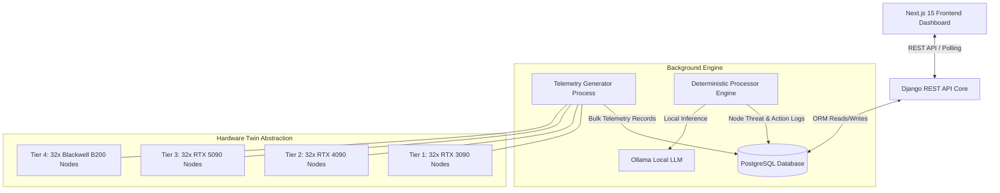

# 🧠 NeuronOps Technical Documentation Portal

Welcome to the official technical documentation for **NeuronOps** — an AI Cluster Intelligence Platform and Digital Twin of an AI GPU Datacenter.

NeuronOps is designed to sit directly above physical or virtualized GPU cluster orchestration layers (such as Kubernetes and Ray) to deliver autonomous workload scheduling, predictive thermal and failure operations, real-time energy and cost waste mitigation, and human-in-the-loop approval management.

---

## 📚 Complete Documentation Index

### 1. 🏗️ System Architecture & Engineering (`docs/architecture/`)
* [System Overview](file:///d:/Ai-Cluster/docs/architecture/system-overview.md) — High-level digital twin platform design and core architectural goals.
* [Component Diagram](file:///d:/Ai-Cluster/docs/architecture/component-diagram.md) — Comprehensive topology of frontend, backend services, background workers, and databases.
* [Data Flow](file:///d:/Ai-Cluster/docs/architecture/data-flow.md) — End-to-end data pipeline from raw telemetry generation to state visualization and autonomous triggers.
* [Deployment Flow](file:///d:/Ai-Cluster/docs/architecture/deployment-flow.md) — Multi-container execution lifecycle across Docker Compose and Kubernetes environments.

### 2. ⚡ GPU Cluster & Hardware Simulation (`docs/cluster/`)
* [Cluster Architecture](file:///d:/Ai-Cluster/docs/cluster/cluster-architecture.md) — 128-node grid topology, quad-tier hardware specification, and node indexing.
* [Node Lifecycle](file:///d:/Ai-Cluster/docs/cluster/node-lifecycle.md) — Node state machine (Active, Idle, Thermal Breach, Evicted, Offline) and failover triggers.
* [GPU Simulation Engine](file:///d:/Ai-Cluster/docs/cluster/gpu-simulation.md) — NVIDIA DCGM telemetry emulation, VRAM usage modeling, power draw calculation, and thermal drift dynamics.
* [Tier System](file:///d:/Ai-Cluster/docs/cluster/tier-system.md) — Hardware tiering (RTX 3090, 4090, 5090, Blackwell B200) and capability matrices.
* [Telemetry Generation](file:///d:/Ai-Cluster/docs/cluster/telemetry.md) — In-depth breakdown of `telemetry_generator.py`, sampling windows, noise injection, and database pruning.

### 3. ⚙️ Workload Management & Scheduling (`docs/workloads/`)
* [Workload Engine](file:///d:/Ai-Cluster/docs/workloads/workload-engine.md) — Calculation algorithms in `workload_engine.py`, required node math, and complexity multipliers.
* [Workload Lifecycle](file:///d:/Ai-Cluster/docs/workloads/workload-lifecycle.md) — Job submission, processing state transitions, and auto-scaling rules.
* [Smart Scheduler](file:///d:/Ai-Cluster/docs/workloads/scheduler.md) — Autonomous node allocation, bin-packing, preemption policies, and load shedding.
* [Fallback System](file:///d:/Ai-Cluster/docs/workloads/fallback-system.md) — Idle tier fallback, automatic down-scaling, and live workload migration.
* [Approval Gate](file:///d:/Ai-Cluster/docs/workloads/approvals.md) — Human-in-the-loop and autonomous policy execution (`gate` module).

### 4. 🤖 AI & Machine Learning Pipeline (`docs/ml/`)
* [Anomaly Detection System](file:///d:/Ai-Cluster/docs/ml/anomaly-detection.md) — Sentinel engine (`sentinel` app), real-time failure probability estimation, and thermal alerts.
* [Recommendation Engine](file:///d:/Ai-Cluster/docs/ml/recommendation-engine.md) — Automated actions generation (rebalancing, node drain, thermal cooldown).
* [Ray Distributed Processing](file:///d:/Ai-Cluster/docs/ml/ray-processing.md) — Distributed inference patterns, worker synchronization, and task queueing.

### 5. 📊 Observability & Monitoring (`docs/monitoring/`)
* [Prometheus Metric System](file:///d:/Ai-Cluster/docs/monitoring/prometheus.md) — Metric exposition formats, scrape targets, and custom gauges.
* [Grafana Visualization](file:///d:/Ai-Cluster/docs/monitoring/grafana.md) — Real-time telemetry dashboards, time-series plotting, and thermal heatmaps.
* [Unified Observability Matrix](file:///d:/Ai-Cluster/docs/monitoring/observability.md) — Log aggregation, health checks, and cluster-wide telemetry correlation.

### 6. 🛠️ Backend System Reference (`docs/backend/`)
* [Django Architecture](file:///d:/Ai-Cluster/docs/backend/django.md) — Project layout, setting configurations, CORS, and modular app relationships.
* [Database Models](file:///d:/Ai-Cluster/docs/backend/models.md) — Complete schema documentation for all models across all 6 Django apps.
* [REST APIs](file:///d:/Ai-Cluster/docs/backend/apis.md) — Endpoint specifications, JSON request/response formats, and HTTP status codes.
* [Database & Storage](file:///d:/Ai-Cluster/docs/backend/database.md) — PostgreSQL setup, indexing strategy, transaction isolation, and query tuning.

### 7. 🎨 Frontend Dashboard & Workstation (`docs/frontend/`)
* [Next.js App Router](file:///d:/Ai-Cluster/docs/frontend/dashboard.md) — React 19 / Next.js 15 layout, state management, and real-time polling hooks.
* [Workstation Interface](file:///d:/Ai-Cluster/docs/frontend/workstation.md) — Simulation controls, interactive 128-node grid map, and task submission forms.
* [Notifications & Alerts](file:///d:/Ai-Cluster/docs/frontend/notifications.md) — Toast alerts, approval popups, and real-time event feeds.

### 8. 🚀 Deployment & Infrastructure (`docs/deployment/`)
* [Docker Containerization](file:///d:/Ai-Cluster/docs/deployment/docker.md) — Multi-service Docker Compose architecture, Dockerfiles, and container volumes.
* [Kubernetes Manifests](file:///d:/Ai-Cluster/docs/deployment/kubernetes.md) — Production Kubernetes deployment configs, Services, and environment variables.
* [Environment Configuration](file:///d:/Ai-Cluster/docs/deployment/configuration.md) — Exhaustive matrix of all environment variables and default fallbacks.

### 9. 📖 Guides & Standards
* [Development Guide](file:///d:/Ai-Cluster/docs/development.md) — Local environment setup for Windows, Linux, and macOS.
* [Contributor Guide](file:///d:/Ai-Cluster/docs/contributing.md) — Code style guidelines, PR procedures, testing practices, and extending the simulator.

---

## 🏛️ High-Level System Architecture Overview



---

## ⚡ Quick Start for Developers

```bash
# 1. Clone & Enter Directory
cd d:/Ai-Cluster

# 2. Start PostgreSQL & Infrastructure Services via Docker
docker-compose up -d db

# 3. Setup Python Backend Environment
cd backend
python -m venv venv
venv\Scripts\activate  # Windows
pip install -r requirements.txt

# 4. Migrate Database & Seed Data
python manage.py migrate
python seed_data.py

# 5. Run Telemetry & Processor Background Services
python telemetry_generator.py &
python processor.py &
python manage.py runserver 0.0.0.0:8000

# 6. Run Frontend Dashboard
cd ../frontend
npm install
npm run dev
```

For detailed setup instructions on Linux and macOS, refer to [development.md](file:///d:/Ai-Cluster/docs/development.md).
