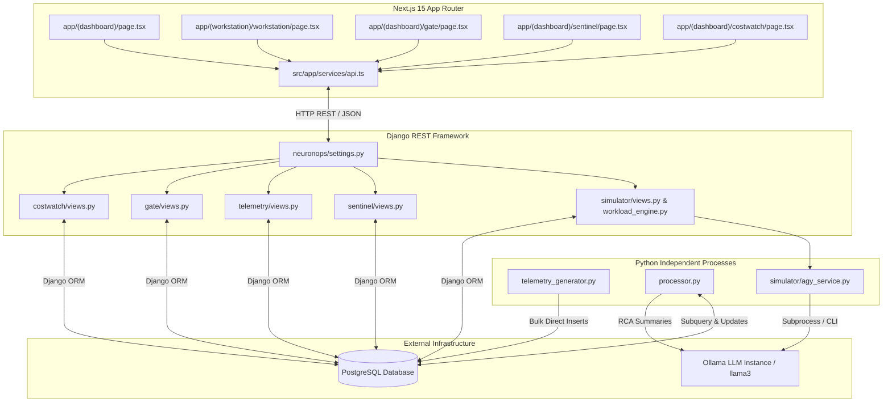

# 🧩 Component Topology & Service Architecture

## 1. Overview

NeuronOps is constructed using a microservices-inspired monolithic architecture with separate background worker runtimes. This document details every internal service, its responsibilities, dependencies, communication protocols, and code references.

---

## 2. Comprehensive Component Topology Diagram

---

## 3. Subsystem Breakdown

### A. Frontend Subsystem (`frontend/src/app`)
* **Technology Stack**: Next.js 15, React 19, TypeScript, Tailwind CSS, Lucide React icons.
* **Primary Responsibilities**:
  * Render real-time cluster map grid (`Node-001` to `Node-128`) with heat intensity.
  * Receive user workload execution requests via the Workstation interface.
  * Polling state updates from backend APIs every 3–5 seconds.
  * Render Sentinel alerts, CostWatch metrics, and Approval Gate requests.
* **Key Files**:
  * [frontend/src/app/(dashboard)/page.tsx](file:///d:/Ai-Cluster/frontend/src/app/(dashboard)/page.tsx)
  * [frontend/src/app/services/api.ts](file:///d:/Ai-Cluster/frontend/src/app/services/api.ts)

### B. Backend API Core (`backend/`)
* **Technology Stack**: Django 5.x, Django REST Framework, Gunicorn, PostgreSQL ORM.
* **Primary Applications**:
  * `simulator`: Workload submission, node calculation, simulation session management ([backend/simulator/views.py](file:///d:/Ai-Cluster/backend/simulator/views.py)).
  * `telemetry`: Metrics retrieval API ([backend/telemetry/views.py](file:///d:/Ai-Cluster/backend/telemetry/views.py)).
  * `sentinel`: Failure prediction and thermal alerts ([backend/sentinel/views.py](file:///d:/Ai-Cluster/backend/sentinel/views.py)).
  * `gate`: Action approval workflow ([backend/gate/views.py](file:///d:/Ai-Cluster/backend/gate/views.py)).
  * `costwatch`: Idle node detection and energy waste calculation ([backend/costwatch/views.py](file:///d:/Ai-Cluster/backend/costwatch/views.py)).

### C. Background Worker Runtimes
* **Telemetry Generator** ([telemetry_generator.py](file:///d:/Ai-Cluster/backend/telemetry_generator.py)):
  * Operates a perpetual `while True` loop with `time.sleep(5)`.
  * Computes active workstation loads and applies thermal/utilization drift to 128 nodes.
  * Performs bulk database inserts via `GpuTelemetry.objects.bulk_create()`.
  * Automatically prunes records older than 10 minutes.
* **Deterministic Processor Engine** ([processor.py](file:///d:/Ai-Cluster/backend/processor.py)):
  * Executes every 5 seconds using Django ORM subqueries (`OuterRef`, `Subquery`).
  * Calculates dynamic failure probability: `prob = (temperature - 40) / 60.0`.
  * Triggers auto-resolving alerts for thermal threshold breaches (`> 90°C`).
  * Initiates live migrations to idle nodes or deterministic job eviction.

---

## 4. Inter-Service Communication Protocols

| Source | Destination | Protocol / Format | Purpose | Frequency |
|:---|:---|:---|:---|:---|
| Frontend | Django REST API | HTTP / JSON | State polling & task submission | Every 3s–5s |
| Telemetry Generator | PostgreSQL | Direct SQL / ORM Bulk Insert | Telemetry record writing | Every 5s |
| Processor Engine | PostgreSQL | SQL Subquery / Transaction | Cluster health evaluation & alert generation | Every 5s |
| Processor Engine | Local Ollama | HTTP / REST API (port 11434) | Root-cause text generation (`llama3`) | On thermal incident |
| Simulator API | Antigravity CLI | Subprocess execution | AI analysis report creation | On simulation submit |
