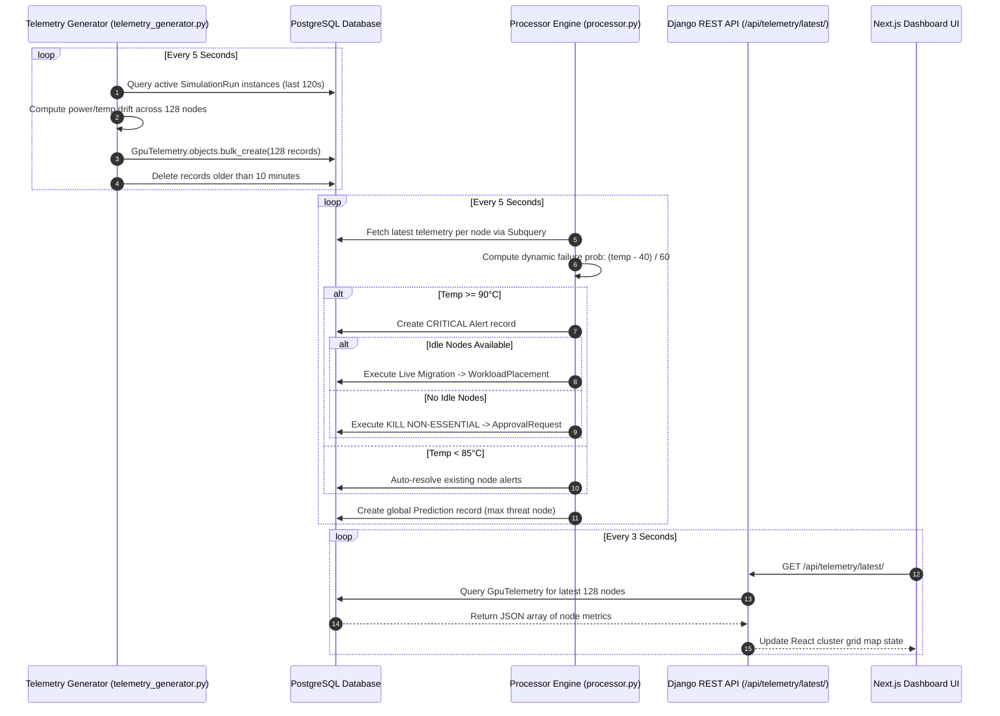
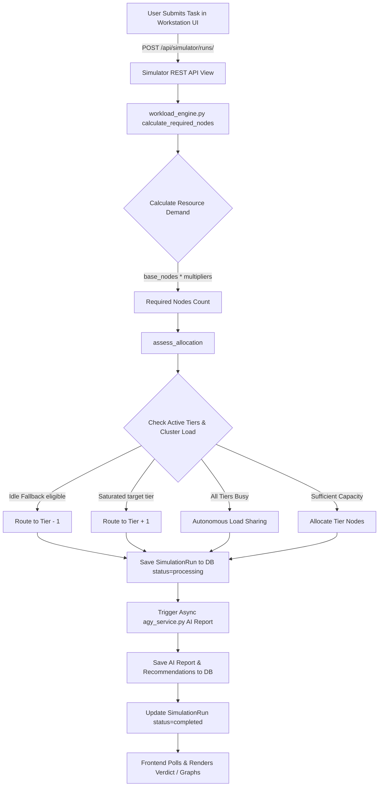

# 🔄 Complete End-to-End Data Flow Architecture

## 1. Overview

This document details how data moves through the NeuronOps platform across three primary operational loops:
1. **The Telemetry Data Pipeline**: Metric generation -> database storage -> background evaluation -> UI polling.
2. **The Workload Execution Pipeline**: User request submission -> calculation engine -> tier selection -> auto-scaling -> status updates.
3. **The Autonomous Remediation Loop**: Thermal breach detection -> failure probability calculation -> migration/eviction trigger -> approval gate log.

---

## 2. Telemetry Pipeline Sequence Diagram

---

## 3. Workload Execution Data Flow

---

## 4. Operational Threshold Data Matrix

The following table summarizes the data state transformations triggered by real-time metrics:

| Metric | Condition | Component Responsible | Action Taken | DB Model Updated |
|:---|:---|:---|:---|:---|
| **Temperature** | `≥ 90°C` | `processor.py` | Generate CRITICAL thermal alert | `sentinel.Alert` |
| **Temperature** | `< 85°C` | `processor.py` | Auto-resolve existing alerts | `sentinel.Alert` |
| **Temperature** | `≥ 90°C` & Idle Nodes Exist | `processor.py` | Auto-migrate live workload | `scheduler.WorkloadPlacement` & `gate.ApprovalRequest` |
| **Temperature** | `≥ 90°C` & No Idle Nodes | `processor.py` | Execute deterministic non-essential workload eviction | `gate.ApprovalRequest` |
| **GPU Utilization** | `< 5%` | `processor.py` | Record energy waste report | `costwatch.CostReport` |
| **Cluster Load** | `> 80%` | `processor.py` | Trigger AI autonomous task termination query | `simulator.SimulationRun` & `gate.ApprovalRequest` |
| **Cluster Load** | `> 90%` | `processor.py` | Auto-execute Emergency Load Shedding | `gate.ApprovalRequest` |
