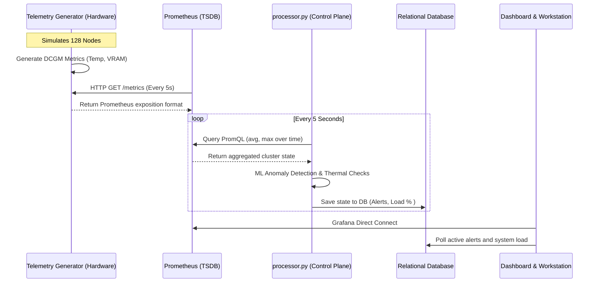
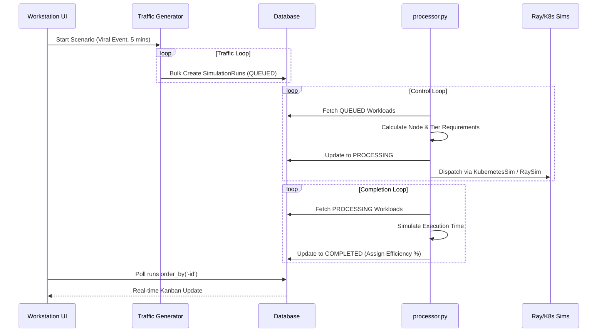

# Data Flow Architecture

NeuronOps is primarily a data-driven system. There are two major streams of data flowing through the architecture: **Telemetry Data** (bottom-up from the hardware simulation) and **Workload Data** (top-down from the user scenarios).

## Telemetry Data Flow (Hardware up to UI)

### Telemetry Lifecycle
1. **Generation (`telemetry_generator.py`)**: Runs continuously, applying sine waves and randomized noise to simulate GPUs under load, including injecting simulated failures based on the `disaster_state.json`.
2. **Scraping (Prometheus)**: Standard TSDB scraping of the exposed endpoint.
3. **Analysis (`processor.py`)**: Queries Prometheus via PromQL to determine if the cluster is overheating (`dcgm_fi_dev_gpu_temp > 85`) or overallocated (`sum(dcgm_fi_prof_gr_engine_active) > 95%`).
4. **Action**: If anomalies are found, the Control Plane generates interventions in the Database, which are instantly reflected in the React Workstation UI.

---

## Workload Data Flow (Scenario down to Hardware)

### Workload Lifecycle
1. **Injection (`traffic_generator.py`)**: Reads the active configuration and creates database records representing tasks (e.g., `video_generation`, `llm_training`).
2. **Scheduling (`processor.py - SchedulerEngine`)**: Pulls these records, maps them to required hardware tiers, and pseudo-allocates them using mocked infrastructure APIs (`cluster_infra`).
3. **Resolution**: The Control Plane finishes the jobs, marking them complete and assigning efficiency scores.
