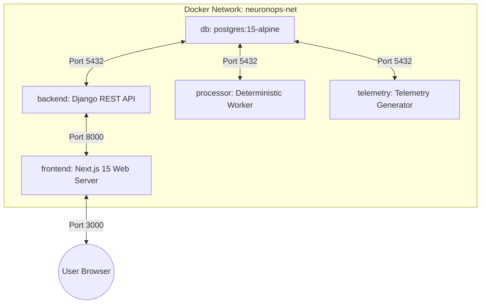
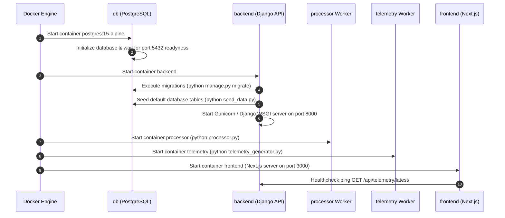

# 🚀 Deployment Architecture & Container Orchestration

## 1. Overview

NeuronOps is containerized for seamless deployment across local development environments, staging clusters, and production-grade Kubernetes infrastructures. This document covers container topologies, startup dependencies, volume management, and orchestrator configurations.

---

## 2. Docker Compose Infrastructure Topology

The project provides a multi-container arrangement defined in [docker-compose.yml](file:///d:/Ai-Cluster/docker-compose.yml).



---

## 3. Container Specifications & Dependency Graph

### Service Definitions

#### 1. `db` (PostgreSQL Database)
* **Image**: `postgres:15-alpine`
* **Exposed Ports**: `5432:5432`
* **Volume Mount**: `pgdata:/var/lib/postgresql/data`
* **Environment Variables**: `POSTGRES_USER=neuronops`, `POSTGRES_PASSWORD=password`, `POSTGRES_DB=neuronops_db`

#### 2. `backend` (Django REST API)
* **Build Context**: `./backend` ([backend/Dockerfile](file:///d:/Ai-Cluster/backend/Dockerfile))
* **Exposed Ports**: `8000:8000`
* **Dependencies**: `db`
* **Command**: `gunicorn neuronops.wsgi:application --bind 0.0.0.0:8000` (or `python manage.py runserver 0.0.0.0:8000`)

#### 3. `processor` (Background Processor Engine)
* **Build Context**: `./backend`
* **Dependencies**: `db`, `backend`
* **Command**: `python processor.py`

#### 4. `telemetry` (Telemetry Generator)
* **Build Context**: `./backend`
* **Dependencies**: `db`, `backend`
* **Command**: `python telemetry_generator.py`

#### 5. `frontend` (Next.js Dashboard)
* **Build Context**: `./frontend` ([frontend/Dockerfile](file:///d:/Ai-Cluster/frontend/Dockerfile))
* **Exposed Ports**: `3000:3000`
* **Dependencies**: `backend`
* **Environment Variables**: `NEXT_PUBLIC_API_URL=http://backend:8000/api`

---

## 4. Container Startup Lifecycle Sequence



---

## 5. Kubernetes Production Architecture

For production Kubernetes deployments, NeuronOps translates into the following Kubernetes resources:

```yaml
# Conceptual Kubernetes Topology
Namespaces:
  - neuronops-system

Deployments:
  - backend-deployment (Replicas: 3, HPA: 50% CPU)
  - processor-deployment (Replicas: 1, Singleton Lock)
  - telemetry-generator-deployment (Replicas: 1, Singleton Lock)
  - frontend-deployment (Replicas: 2)

StatefulSets:
  - postgres-statefulset (1 Primary, 1 Read Replica)

Services:
  - backend-service (ClusterIP: Port 8000)
  - frontend-service (LoadBalancer / Ingress: Port 80 / 443)
  - postgres-service (ClusterIP: Port 5432)
```

For full Kubernetes deployment manifests, refer to [kubernetes.md](file:///d:/Ai-Cluster/docs/deployment/kubernetes.md).
