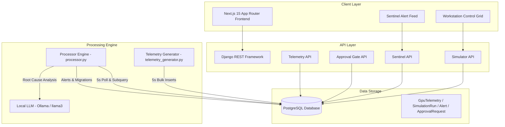

# 🏛️ System Overview: NeuronOps Digital Twin Platform

## 1. Executive Summary

**NeuronOps** is an enterprise-grade AI Cluster Intelligence Platform and Digital Twin designed to manage, monitor, and optimize high-density GPU computing clusters. In modern AI infrastructure, GPU clusters face extreme thermal variation, unpredictable workload bursts, inefficient node utilization, and high energy waste.

NeuronOps addresses these challenges by creating a real-time digital twin of a 128-node GPU cluster. It combines:
1. **Hardware Simulation**: Emulating 4 tiers of GPU architecture (RTX 3090, RTX 4090, RTX 5090, Blackwell B200) with realistic thermal, power, and VRAM dynamics.
2. **Deterministic & Predictive AIOps**: Continuously calculating node failure probabilities, managing automatic live workload migrations, and executing emergency load shedding.
3. **Autonomous Scheduling**: Evaluating incoming compute requests, calculating required node counts based on workload complexity, and auto-scaling allocations.
4. **Cost & Energy Optimization**: Identifying idle nodes (`<5%` GPU utilization), calculating power waste in USD, and auto-releasing surplus resources.

---

## 2. Core Architectural Principles

NeuronOps is architected around 5 primary principles:

### A. Decoupled Multi-Tier Process Architecture
The platform separates real-time metric generation, background analysis, REST service handling, and user interface rendering into dedicated processes:
* **Telemetry Generator** ([telemetry_generator.py](file:///d:/Ai-Cluster/backend/telemetry_generator.py)): Writes continuous GPU telemetry metrics at 5-second intervals.
* **Deterministic Processor Engine** ([processor.py](file:///d:/Ai-Cluster/backend/processor.py)): Evaluates cluster-wide thermal risk, creates failure alerts, triggers migrations, and initiates load shedding.
* **Django Web Server** ([backend/neuronops](file:///d:/Ai-Cluster/backend/neuronops)): Handles REST API traffic from the frontend dashboard.
* **Next.js 15 Frontend** ([frontend/](file:///d:/Ai-Cluster/frontend)): Renders real-time cluster visualization and interactive workstation controls.

### B. High-Frequency State Synchronization via PostgreSQL
All services communicate through a centralized PostgreSQL instance. Data structures use indexed subqueries to fetch latest node states efficiently while background workers automatically prune historical telemetry records older than 10 minutes to prevent database bloat.

### C. Fail-Safe Autonomous Control with Human Escalation
* **Load `< 80%`**: Normal operation. Workloads scale automatically according to complexity rules.
* **Load `80% - 90%`**: Autonomous AI decision mode. Low-priority workloads are terminated or placed on hold to maintain stability.
* **Load `> 90%`**: Emergency load shedding executed autonomously, with full audit trail logging in the Approval Gate (`gate` app).
* **Thermal Spike `> 90°C`**: Instant critical alert generated. If idle nodes exist, live migration occurs immediately; if no idle nodes exist, deterministic non-essential job eviction takes place.

---

## 3. High-Level System Architecture Diagram

---

## 4. Hardware Quadrant Abstraction

The simulated 128-node GPU cluster is divided into 4 equal hardware quadrants of 32 nodes each:

| Quadrant | Node Range | Hardware Profile | VRAM per Node | Default Power Range | Default Temp Range |
|:---|:---|:---|:---|:---|:---|
| **Tier 1** | `Node-001` to `Node-032` | NVIDIA RTX 3090 | 24 GB GDDR6X | 330W – 350W | 63°C – 67°C |
| **Tier 2** | `Node-033` to `Node-064` | NVIDIA RTX 4090 | 24 GB GDDR6X | 420W – 450W | 58°C – 62°C |
| **Tier 3** | `Node-065` to `Node-096` | NVIDIA RTX 5090 | 32 GB GDDR7 | 560W – 600W | 56°C – 60°C |
| **Tier 4** | `Node-097` to `Node-128` | Blackwell B200 | 192 GB HBM3 | 660W – 700W | 53°C – 57°C |

---

## 5. Key System Capabilities

* **Workload Auto-Scaling**: Calculates node requirements via `base_nodes * (1 + 0.1 * thinking_depth) * complexity_factor`.
* **Autonomous Tier Routing**: Automatically redirects tasks to higher or lower hardware tiers when target tiers are saturated.
* **Idle Resource Fallback**: Moves lightweight jobs to Tier 1 nodes to preserve high-tier GPUs (Blackwell B200) for heavy ML training.
* **Thermal Crash Injection**: Simulates random hardware stress spikes when cluster utilization exceeds 50%, testing self-healing failover routines.
