# System Overview

## Introduction
NeuronOps is a comprehensive Digital Twin and AI Cluster Intelligence platform. Instead of managing real hardware, NeuronOps simulates a massive 128-node (512 GPU) datacenter, complete with network traffic, thermal anomalies, workload demands, and hardware constraints. 

It wraps this simulation in a production-grade AIOps platform that actively monitors the system, schedules workloads, predicts failures, and migrates tasks to save power and prevent overheating.

## High-Level Architecture

The system is composed of several independent subsystems acting together in a distributed manner, mirroring real-world AIOps stacks.

```mermaid
graph TD
    subgraph "Client Layer"
        UI[Frontend UI - Next.js]
        Dashboard[Grafana Dashboards]
    end

    subgraph "AI Control Plane"
        Processor[processor.py Engine]
        Scheduler[Workload Scheduler]
        Predictor[Failure Prediction ML]
        CostOpt[Cost Optimization]
    end

    subgraph "Simulation Layer (Django API)"
        TrafficGen[Traffic Generator]
        WorkloadEng[Workload Engine]
        DB[(PostgreSQL/SQLite)]
    end

    subgraph "Infrastructure Layer"
        Telemetry[telemetry_generator.py]
        Prometheus[(Prometheus TSDB)]
        RaySim[Ray Distributed Simulation]
        K8sSim[Kubernetes Pod Simulation]
    end

    %% Data Flow
    TrafficGen -- "Creates Workloads" --> DB
    Processor -- "Pulls & Assigns" --> DB
    Processor -- "Dispatches" --> RaySim
    Processor -- "Deploys" --> K8sSim

    Telemetry -- "Scrapes GPU Data" --> Prometheus
    Dashboard -- "Visualizes" --> Prometheus
    Processor -- "Analyzes Metrics" --> Prometheus
    UI -- "Controls via API" --> DB
```

### 1. Client Layer
- **Workstation UI**: A Next.js application providing the interface for operators to start simulations, define traffic scenarios (e.g. Viral Events vs Startups), and interact with the AI assistant.
- **Grafana**: Hooks directly into Prometheus to visualize the massive stream of simulated GPU metrics.

### 2. Simulation Layer (Backend)
- **Django Backend**: Serves as the central state machine.
- **Traffic Generator**: A background daemon that dynamically creates `SimulationRun` objects (e.g. LLM Inference, Video Rendering) based on the active scenario and writes them to the database in a `queued` state.
- **Workload Engine**: Calculates exactly how many GPUs, Tiers, and constraints are required for any given task.

### 3. AI Control Plane (Processor)
- **processor.py**: The heart of the platform. It continuously loops, performing:
  - **Workload Scheduling**: Pulling `queued` jobs and assigning them.
  - **Live Migration**: Detecting hot nodes and moving workloads to cold nodes.
  - **Consolidation**: Merging fragmented jobs on idle nodes to save power.
  - **Capacity Shedding**: Killing low-priority batch jobs if the cluster hits 95% utilization.

### 4. Infrastructure Layer
- **telemetry_generator.py**: Simulates NVIDIA DCGM. It creates realistic temperature curves, VRAM spikes, and power usage across 128 nodes, exposing them on a `/metrics` endpoint.
- **Prometheus**: Scrapes the telemetry generator every 5 seconds.
- **Ray & Kubernetes Sims**: Code-level abstractions used by the Scheduler to represent final workload assignment.
