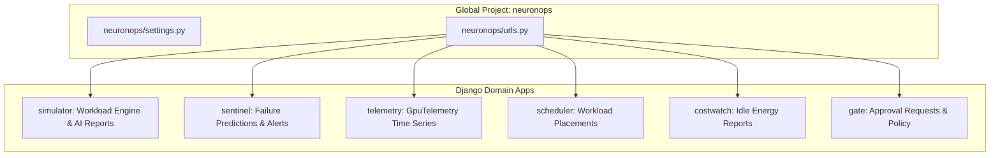

# 🐍 Django Project Architecture & Apps Structure

## 1. Overview

The backend of **NeuronOps** is implemented using Python 3.11+, Django 5.x, and Django REST Framework. It is structured into 6 decoupled domain applications managed by a central configuration package ([backend/neuronops](file:///d:/Ai-Cluster/backend/neuronops)).

---

## 2. Directory Structure & App Layout

```
backend/
├── manage.py                  # Django management CLI entrypoint
├── processor.py               # Independent deterministic background processor
├── telemetry_generator.py     # Independent telemetry generation service
├── seed_data.py               # Initial database seeder script
├── setup_api.py               # API bootstrapping utility
├── neuronops/                 # Global Settings & URL Configuration
│   ├── settings.py
│   ├── urls.py
│   ├── wsgi.py
│   └── asgi.py
├── simulator/                 # Workload Engine & Simulation Session App
├── sentinel/                  # Anomaly Detection & Failure Alert App
├── telemetry/                 # GPU Metrics Data Store & API App
├── scheduler/                 # Workload Placement & Live Migration App
├── costwatch/                 # Energy Waste & Cost Analytics App
└── gate/                      # Approval Governance & HITL App
```

---

## 3. Modular App Responsibilities



### App Descriptions:
1. `simulator`: Handles workstation task submissions, calculates node demands, runs tier selection algorithms, and manages async AI report generation.
2. `sentinel`: Tracks node failure probabilities (`Prediction`) and active thermal warnings (`Alert`).
3. `telemetry`: Stores high-frequency metric records (`GpuTelemetry`).
4. `scheduler`: Logs workload movement across nodes (`WorkloadPlacement`).
5. `costwatch`: Records idle node count and computes wasted power cost in USD (`CostReport`).
6. `gate`: Manages human operator review and autonomous policy execution (`ApprovalRequest`).

---

## 4. Key Settings & Global Configurations

* **Installed Apps**: Registered in `INSTALLED_APPS` inside [backend/neuronops/settings.py](file:///d:/Ai-Cluster/backend/neuronops/settings.py).
* **CORS Policy**: Configured via `django-cors-headers` to permit Next.js frontend cross-origin requests (`CORS_ALLOW_ALL_ORIGINS = True` in dev).
* **Ollama Integration**: Configured via `OLLAMA_BASE_URL` (default `http://localhost:11434/v1`) and `LLM_MODEL` (default `llama3`).
