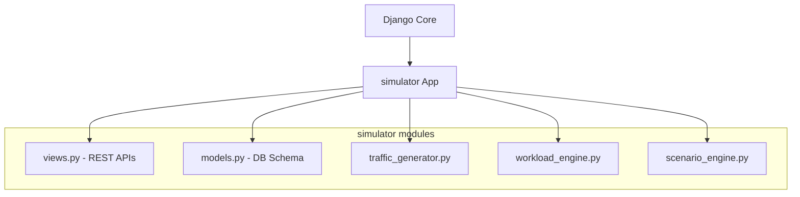

# Django Backend Architecture

The NeuronOps backend is built on Django and Django REST Framework (DRF). Unlike a standard web application backend, this Django implementation acts as a robust **State Machine and Coordination Layer** for the simulated AI datacenter.

## App Structure
The backend is primarily contained within the `simulator` app.

## Core Components

### 1. `traffic_generator.py`
A background daemon initialized during server startup. It continually polls the active scenario configuration (via `ScenarioEngine`) and executes `SimulationRun.objects.bulk_create()` to inject user workloads into the database. It handles load multipliers (Time Acceleration) and traffic patterns (e.g. Peak Hours, Viral Events).

### 2. `scenario_engine.py`
A stateful in-memory configuration manager. It tracks the current running scenario, its duration, the requested `time_acceleration`, and the allowed task types based on the selected `CompanyProfile`.

### 3. `workload_engine.py`
The strict mathematical rules engine. It dictates how many GPUs are required for any given task, what hardware Tier is appropriate, and whether a deployment is physically feasible based on node constraints.

### 4. `processor.py` (External to Django)
While technically residing in the `backend/` directory, `processor.py` is a standalone daemon. It interfaces with the Django database via the Django ORM to pull jobs, execute Machine Learning assessments, and process the actual task state transitions.
