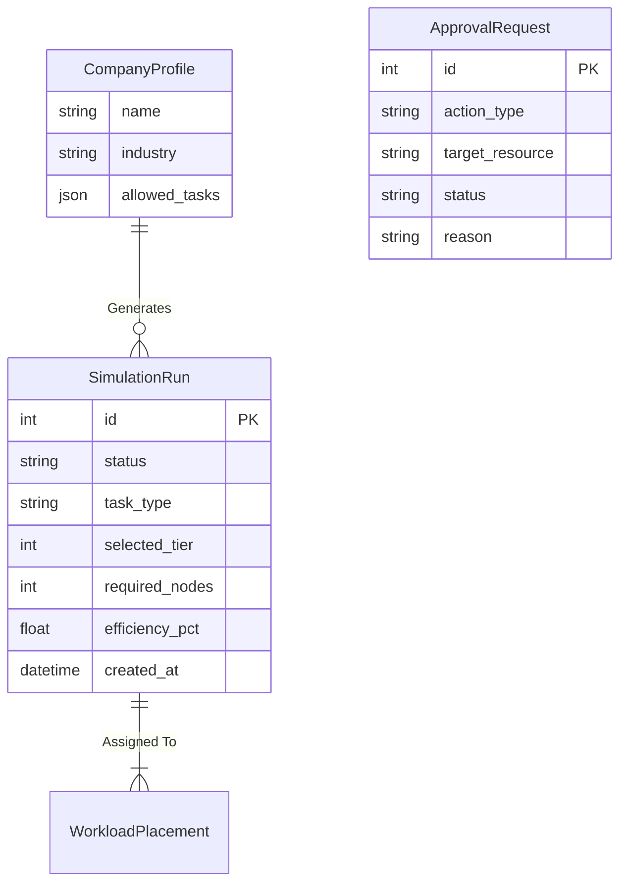

# Database Models

The central source of truth for the entire NeuronOps cluster state is the relational database, managed via the Django ORM.

## Entity Relationship Diagram

## Core Models (`backend/simulator/models.py`)

### 1. `SimulationRun`
The most active table in the system. It represents a single workload/job injected into the cluster.
- **`status`**: The state of the workload (`queued`, `processing`, `completed`, `failed`).
- **`efficiency_pct`**: Populated only upon completion, indicating how optimally the job ran based on hardware availability and thermal throttling.
- **`selected_tier`**: The hardware tier (1-4) chosen by the Scheduler Engine.

### 2. `CompanyProfile`
Allows the simulation of multi-tenant architectures. Different companies have different `allowed_tasks` (e.g., OpenAI generating LLM Training tasks, vs a VFX studio generating Video Rendering tasks).

### 3. `ApprovalRequest`
Used by the AI Control Plane to enforce human-in-the-loop oversight. 
When the cluster hits critical thermal limits or massive load spikes (>95%), the AI might propose "Capacity Shedding" or "Live Migration". These are written to this table with a `PENDING` status and surfaced to the UI.
