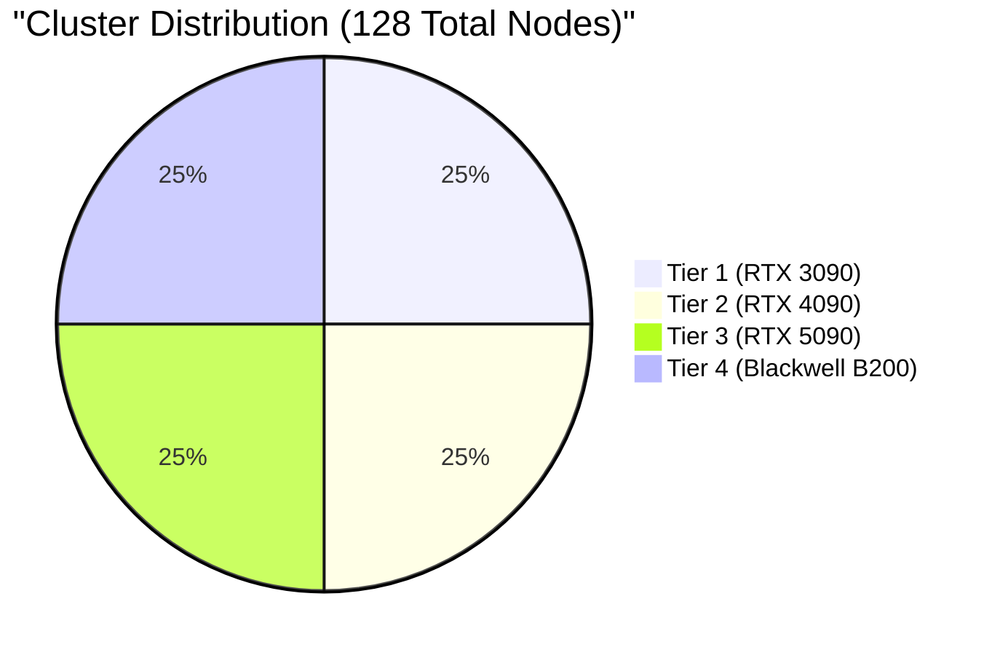
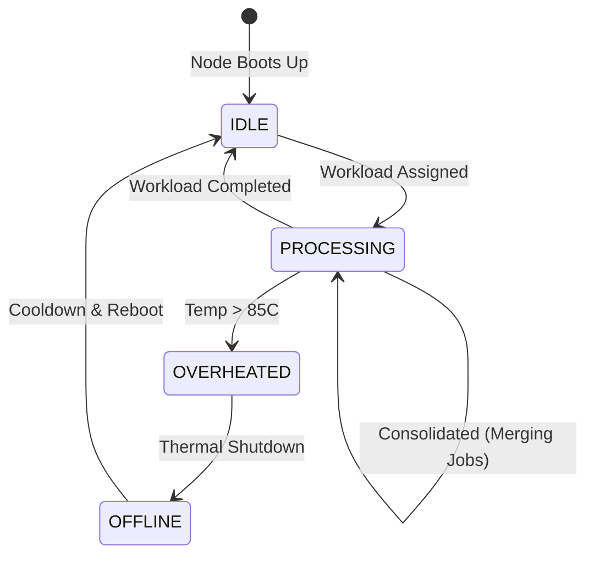

# Cluster Architecture

## Physical Layout Simulation
NeuronOps simulates a massive 128-node GPU cluster. Rather than dealing with homogenous nodes, the datacenter is segmented into **Tiers**, representing generational hardware leaps and varying capabilities.

## Tier Definitions
The tier constraints are codified in [`backend/simulator/workload_engine.py`](file:///d:/Ai-Cluster/backend/simulator/workload_engine.py). When the `SchedulerEngine` assigns a workload, it attempts to assign it to the cheapest tier that satisfies the workload's constraints.

| Tier Level | Name | RAM | VRAM | Base Power Draw | Operating Temp | Use Case |
|---|---|---|---|---|---|---|
| **Tier 1** | RTX 3090 Build | 16GB DDR5 | 24GB GDDR6X | 350W | 65°C | Lightweight tasks, text NLP |
| **Tier 2** | RTX 4090 Build | 32GB DDR5 | 24GB GDDR6X | 450W | 60°C | Image generation, mid-tier processing |
| **Tier 3** | RTX 5090 Build | 64GB DDR5 | 32GB GDDR7 | 600W | 58°C | Heavy 3D rendering, video synthesis |
| **Tier 4** | Blackwell B200 | 128GB LPDDR5 | 192GB HBM3 | 700W | 55°C | LLM Pre-training, intensive batches |

## Node State Machine
Each node in the 128-node array continuously transitions through states based on the workload demands and the control plane interventions.

## Telemetry Mapping
Instead of tracking 128 physical machines, the state of the cluster is generated mathematically by `backend/telemetry_generator.py`. 
- Every 5 seconds, it emits a `dcgm_fi_dev_gpu_temp` and `dcgm_fi_prof_gr_engine_active` metric for all 128 nodes.
- The base temperature is dictated by the Tier (e.g. Tier 4 runs cooler natively than Tier 1).
- Workloads assigned by the `SchedulerEngine` act as multipliers, dynamically driving up the heat and power usage for specific nodes.
