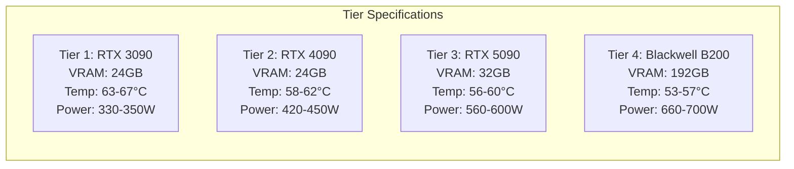

# 🖥️ GPU Simulation Engine & Telemetry Modeling

## 1. Overview

Rather than requiring physical NVIDIA DCGM (Data Center GPU Manager) hardware agents or cloud GPU instances, **NeuronOps** incorporates a realistic software digital twin simulation engine located in [telemetry_generator.py](file:///d:/Ai-Cluster/backend/telemetry_generator.py).

This document details the mathematical algorithms governing metric generation, thermal drift, power draw scaling, VRAM allocation, and thermal crash simulation.

---

## 2. Dynamic Telemetry Metric Formulas

### A. Smooth Thermal & Utilization Drift Algorithm
To prevent unrealistic, discontinuous jumps in telemetry charts, metrics drift smoothly towards target random bounds using the `apply_drift()` function:

$$\text{NextValue} = \begin{cases} 
\min(\text{Current} + \text{Uniform}(0, \text{step}), \text{TargetMax}) & \text{if } \text{Current} < \text{Target} \\
\max(\text{Current} - \text{Uniform}(0, \text{step}), \text{TargetMin}) & \text{otherwise}
\end{cases}$$

Where `step = 1.5` degrees/percent per tick.

```python
# From telemetry_generator.py (lines 56-61)
def apply_drift(current, target_min, target_max, step=1.5):
    target = random.uniform(target_min, target_max)
    if current < target:
        return min(current + random.uniform(0, step), target_max)
    else:
        return max(current - random.uniform(0, step), target_min)
```

---

## 3. Telemetry Parameter Specifications by Hardware Tier

When a node is assigned an active workload, its metrics drift towards its tier specification targets:



### Active Node VRAM Calculation
$$\text{VRAM}_{\text{usage}} = \text{apply\_drift}(\text{CurrentVRAM}, 0.70 \times \text{VRAM}_{\text{total}}, 0.90 \times \text{VRAM}_{\text{total}})$$

Active jobs consume between **70% and 90%** of available VRAM on assigned nodes.

---

## 4. Failure Probability Calculation (Sentinel Engine)

In [processor.py](file:///d:/Ai-Cluster/backend/processor.py), the dynamic node failure probability is derived directly from live temperature telemetry:

$$P(\text{Failure}) = \max\left(0.01, \min\left(0.95, \frac{T_{\text{celsius}} - 40}{60.0}\right)\right)$$

### Key Threshold Milestones:
* At **40°C**: $P(\text{Failure}) = 0.01$ (1% baseline baseline probability).
* At **70°C**: $P(\text{Failure}) = 0.50$ (50% risk score).
* At **90°C**: $P(\text{Failure}) = 0.83$ (83% risk score — critical alert generated).
* At **97°C+**: $P(\text{Failure}) = 0.95$ (95% maximum risk ceiling).

---

## 5. Random Thermal Anomaly Simulation

To test autonomous failover and emergency load shedding routines under heavy stress, the telemetry engine introduces random thermal crashes:

```python
# From telemetry_generator.py (lines 107-112)
thermal_crash_node = None
if len(active_node_indices) > 64 and random.random() < 0.05:
    # Pick a random active node to crash
    thermal_crash_node = NODES[random.choice(list(active_node_indices))]
    print(f"🔥 THERMAL CRASH SIMULATED ON {thermal_crash_node} 🔥")
```

If triggered, the selected node's temperature instantly spikes to **99.5°C** at **100% utilization**, forcing the background processor engine to take immediate corrective action.
