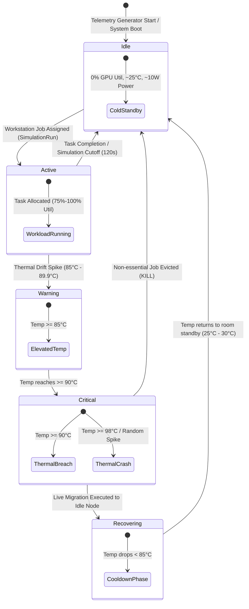

# 🔄 Node Lifecycle & State Transitions

## 1. Overview

Every compute node in the 128-node cluster moves through a defined operational state machine based on workload assignments, thermal telemetry, and system load. This document describes all node states, transition triggers, auto-recovery mechanics, and failure injection routines.

---

## 2. Node State Machine Diagram



---

## 3. Node States Specification

### 1. `OFF / Idle (Standby)`
* **Conditions**: No active workstation simulation run referencing this node in the last 120 seconds.
* **Telemetry Metrics**:
  * Temperature: `25.0°C – 30.0°C` (Room ambient temperature drift).
  * GPU Utilization: `0.0%`.
  * VRAM Usage: `0.0 MB`.
  * Power Draw: `8.0W – 12.0W` (Standby power).

### 2. `Active (Workload Processing)`
* **Conditions**: Assigned to an active `SimulationRun` with status `processing` or `completed`.
* **Telemetry Metrics**: Hardware profile specs according to Tier (e.g. Tier 4 Blackwell: 90-100% util, 660-700W power).

### 3. `Thermal Warning (85.0°C – 89.9°C)`
* **Conditions**: Node temperature elevates due to high workload density.
* **System Behavior**: Logged in processor engine, monitored closely for migration readiness.

### 4. `Critical Thermal Breach (≥ 90.0°C)`
* **Conditions**: Temperature reaches `90°C`.
* **System Action**:
  * Generate `CRITICAL` `Alert` in Sentinel database.
  * If idle nodes exist: Trigger `LLM Session Live Migration` to an available idle node.
  * If no idle nodes exist: Trigger `KILL NON-ESSENTIAL WORKLOADS` via deterministic engine.

### 5. `Thermal Crash (≥ 98.0°C / Random Spike)`
* **Conditions**: Induced when overall active cluster load exceeds 64 nodes (50% utilization) with a 5% random probability per tick.
* **Telemetry Metrics**: Temperature hardcoded to `99.5°C`, GPU utilization forced to `100.0%`.
* **System Action**: Instant emergency intervention and task failover.

---

## 4. Automatic Alert Resolution Lifecycle

When a hot node undergoes successful live migration or job termination, its workload ceases. The node begins cooling down. When `temperature_celsius` drops below `85.0°C`:
```python
# From processor.py (lines 107-109)
elif latest.temperature_celsius < 85:
    # Auto-resolve critical alerts when node cools down below 85C
    Alert.objects.filter(node_id=node, resolved=False).update(resolved=True)
```
This ensures zero manual cleanup overhead for operators while maintaining an accurate live alert feed.
