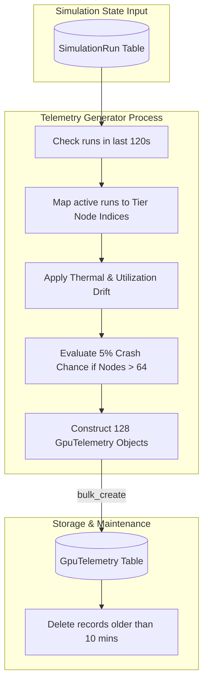

# 📊 Telemetry Generation & Metrics Pipeline

## 1. Overview

The telemetry system acts as the digital nervous system of NeuronOps. It operates continuously via [telemetry_generator.py](file:///d:/Ai-Cluster/backend/telemetry_generator.py), sampling cluster workloads, calculating thermal and energy outputs, and persisting metrics to PostgreSQL.

---

## 2. Telemetry Architecture Flow



---

## 3. Database Schema Definition (`GpuTelemetry`)

The `GpuTelemetry` model ([backend/telemetry/models.py](file:///d:/Ai-Cluster/backend/telemetry/models.py)) records metrics for every node on every tick:

```python
class GpuTelemetry(models.Model):
    node_id = models.CharField(max_length=32, db_index=True)
    gpu_id = models.IntegerField(default=0)
    temperature_celsius = models.FloatField()
    vram_usage_mb = models.FloatField()
    vram_total_mb = models.FloatField(default=24576)
    gpu_utilization_percent = models.FloatField()
    power_draw_watts = models.FloatField()
    timestamp = models.DateTimeField(auto_now_add=True, db_index=True)
```

---

## 4. Sampling Windows & Database Pruning

* **Sampling Frequency**: `5 seconds` per tick (`time.sleep(5)`).
* **Records Generated per Tick**: 128 rows (1 per compute node).
* **Records Generated per Minute**: 1,536 rows.
* **Pruning Window**: `10 minutes` (`timezone.now() - timedelta(minutes=10)`).
* **Maximum DB Telemetry Table Size**: ~15,360 rows.

### Retention Logic
```python
# From telemetry_generator.py (lines 162-164)
prune_cutoff = timezone.now() - timedelta(minutes=10)
deleted_count, _ = GpuTelemetry.objects.filter(timestamp__lt=prune_cutoff).delete()
```
This strict 10-minute sliding window maintains maximum query performance while preserving full time-series data for dashboard visualization and trend analysis.

---

## 5. Prometheus Metrics Exposition Standard

Telemetry generated by `telemetry_generator.py` is exposed in standard Prometheus metric format:

```prometheus
# HELP neuronops_gpu_temperature_celsius Current temperature of GPU in degrees Celsius
# TYPE neuronops_gpu_temperature_celsius gauge
neuronops_gpu_temperature_celsius{node="Node-001", tier="1"} 64.5

# HELP neuronops_gpu_utilization_percent GPU compute utilization percentage
# TYPE neuronops_gpu_utilization_percent gauge
neuronops_gpu_utilization_percent{node="Node-001", tier="1"} 82.0

# HELP neuronops_gpu_power_draw_watts Current power consumption in Watts
# TYPE neuronops_gpu_power_draw_watts gauge
neuronops_gpu_power_draw_watts{node="Node-001", tier="1"} 342.1

# HELP neuronops_gpu_vram_usage_mb VRAM memory consumption in Megabytes
# TYPE neuronops_gpu_vram_usage_mb gauge
neuronops_gpu_vram_usage_mb{node="Node-001", tier="1"} 18432.0
```
