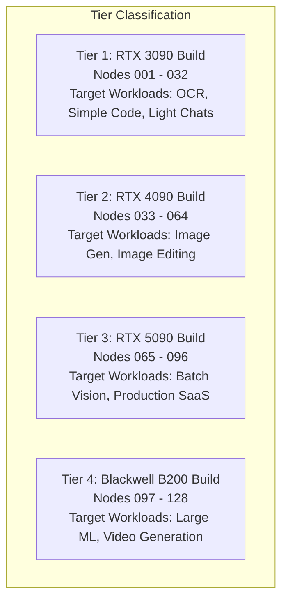

# 🏷️ Hardware Tier System & Placement Policies

## 1. Overview

NeuronOps organizes cluster nodes into 4 standardized Hardware Tiers. Each tier reflects a specific class of GPU infrastructure, enabling intelligent workload routing, idle resource fallback, and energy cost optimization.

---

## 2. Tier Matrix & Capability Specifications



### Detailed Hardware Comparison

| Hardware Attribute | Tier 1 | Tier 2 | Tier 3 | Tier 4 |
|:---|:---|:---|:---|:---|
| **Build Name** | RTX 3090 Build | RTX 4090 Build | RTX 5090 Build | Blackwell B200 Build |
| **Node Range** | `Node-001` - `Node-032` | `Node-033` - `Node-064` | `Node-065` - `Node-096` | `Node-097` - `Node-128` |
| **System Memory** | 16GB DDR5 | 32GB DDR5 | 64GB DDR5 | 128GB LPDDR5 |
| **VRAM Memory** | 24GB GDDR6X | 24GB GDDR6X | 32GB GDDR7 | 192GB HBM3 |
| **Peak Power Rating** | 350W | 450W | 600W | 700W |
| **Theme Color** | Nord Green (`#a3be8c`) | Nord Yellow (`#ebcb8b`) | Nord Orange (`#d08770`) | Nord Red (`#bf616a`) |

---

## 3. Workload-to-Tier Mapping Engine

In [backend/simulator/workload_engine.py](file:///d:/Ai-Cluster/backend/simulator/workload_engine.py), tasks define a mandatory `min_tier` requirement:

```python
TASK_SPECS = {
    "ocr_data_retrieval": {"base_nodes": 8,  "min_tier": 1},
    "normal_chats":       {"base_nodes": 2,  "min_tier": 1},
    "code_edit":          {"base_nodes": 4,  "min_tier": 1},
    "image_generation":   {"base_nodes": 16, "min_tier": 2},
    "image_editing":      {"base_nodes": 12, "min_tier": 2},
    "batch_vision":       {"base_nodes": 24, "min_tier": 3},
    "production_saas":    {"base_nodes": 48, "min_tier": 3},
    "video_generation":   {"base_nodes": 32, "min_tier": 4},
    "large_ml_project":   {"base_nodes": 64, "min_tier": 4},
}
```

---

## 4. Autonomous Routing & Fallback Mechanics

When a workload is submitted, the allocation engine ([workload_engine.py](file:///d:/Ai-Cluster/backend/simulator/workload_engine.py)) evaluates tier availability using two policies:

### A. Idle Resource Fallback
If requested nodes $\le 12$ and target tier $> 1$, the engine checks if a lower tier (e.g. Tier 1) is idle:
```python
if allocated_nodes <= 12 and default_tier > 1:
    fallback_tier = max(1, default_tier - 1)
    if fallback_tier not in active_tiers:
        tier = fallback_tier
        is_idle_fallback = True
```
* **Benefit**: Prevents lightweight chat or small vision queries from monopolizing expensive Tier 4 Blackwell B200 GPUs.

### B. Autonomous Up-Tier Routing
If the default tier is busy (occupied by an active simulation run in the last 120 seconds), the engine searches for an open tier up to Tier 4:
```python
for t in range(default_tier, 5):
    if t not in active_tiers:
        tier = t
        found_tier = True
        break
```
* **Benefit**: Prevents job queueing and latency spikes by upgrading jobs to higher-tier nodes automatically.
