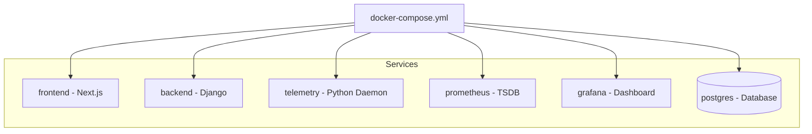

# Docker Deployment

NeuronOps is packaged for local development and demonstration using Docker and Docker Compose.

## Container Architecture

## Startup Flow

When you run `docker compose up`:

1. **Database Boot**: `postgres` starts first.
2. **Backend Migrations**: The `backend` container waits for Postgres, applies Django migrations, and starts the API server.
3. **Daemons**: 
   - `telemetry` boots and immediately begins generating sine-wave GPU data.
   - `processor.py` (the AI Control Plane) boots and begins its infinite polling loop.
4. **Monitoring**: `prometheus` connects to the `telemetry` port, and `grafana` connects to `prometheus`.
5. **Frontend**: The Next.js `frontend` container compiles and exposes port 3000.

## Configuration
Environment variables (like `DATABASE_URL`, `POSTGRES_USER`, and API connection strings) are routed through the `.env` file, ensuring seamless container-to-container network communication without requiring `localhost` hardcoding.
