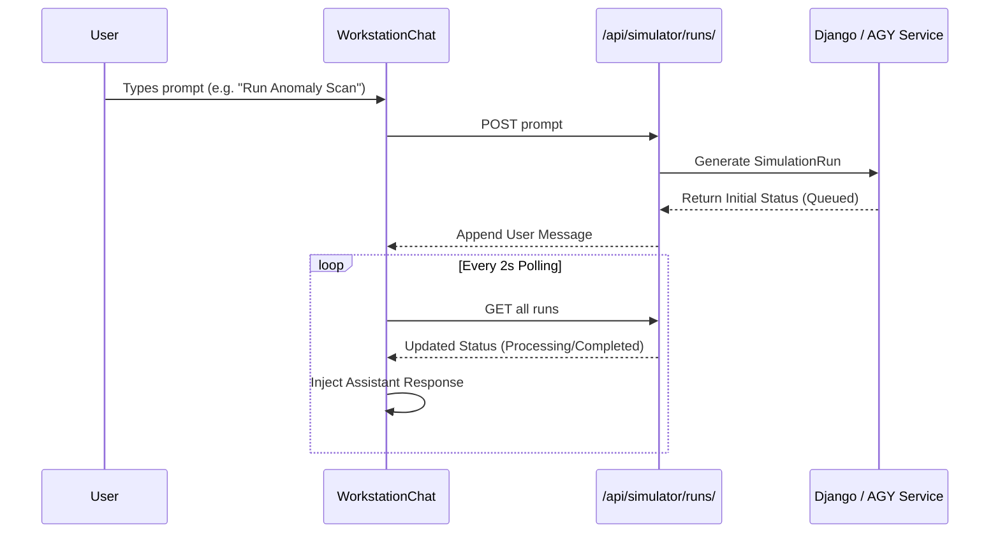

# AI Chat Dashboard

The **AI Chat Dashboard** (`frontend/src/app/(workstation)/workstation/page.tsx`) acts as an interactive assistant interface, allowing operators to interrogate the datacenter state and request specific manual simulations.

## Architecture

The Chat interface groups historical `SimulationRun` entries into threaded conversations (`ChatSession`).

## Core Functionality

### 1. `HistorySidebar`
Groups past simulation runs by `chat_session_id`. It dynamically computes session efficiency and latest status to give operators a historical view of past datacenter events.

### 2. Message Flow Mapping
The frontend maps the raw backend `SimulationRun` states into human-readable chat bubbles:
- **User Message**: The `prompt` text they typed.
- **System Message**: Intermediate states like `Analyzing workload...` when the status is `processing`.
- **Assistant Message**: The final `response_text` provided by the backend's internal AGY logic when the status becomes `completed`.

### 3. Simulator Panel integration
The right side of the screen occasionally renders a `SimulatorPanel` component which visualizes the exact hardware requirements (Nodes, Tier, Efficiency) calculated for the specific conversational prompt.
