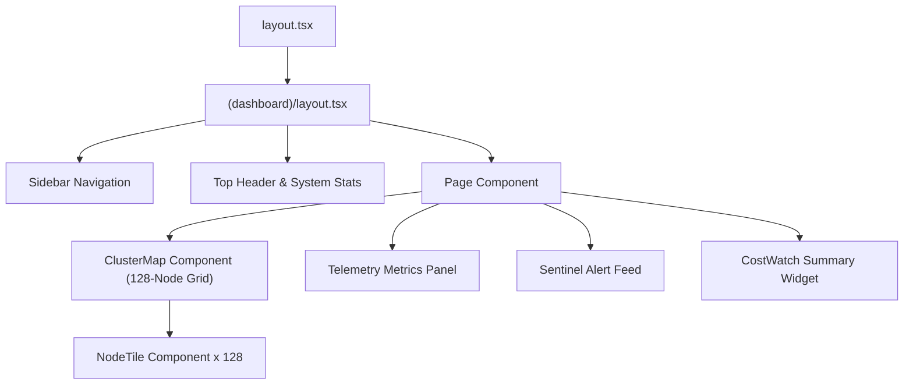

# 🎨 Next.js Dashboard Architecture & Component Hierarchy

## 1. Overview

The **NeuronOps** frontend is built with **Next.js 15 (App Router)**, React 19, TypeScript, Tailwind CSS, and Lucide React icons. It provides a real-time cluster visualizer, interactive workstation, alert feeds, and approval workflows.

---

## 2. Next.js App Router Tree Structure

```
frontend/src/app/
├── layout.tsx                    # Root HTML/Body layout with theme providers
├── page.tsx                      # Dashboard root redirect / lander
├── globals.css                   # Tailwind v4 styles & custom design tokens
├── (dashboard)/                  # Dashboard Route Group
│   ├── layout.tsx                # Sidebar navigation & header wrapper
│   ├── page.tsx                  # Main 128-Node Cluster Map & Telemetry Dashboard
│   ├── sentinel/page.tsx         # Sentinel Anomaly & Alert Feed
│   ├── gate/page.tsx             # Approval Gate Governance Dashboard
│   ├── scheduler/page.tsx        # Smart Scheduler & Migration Tracker
│   └── costwatch/page.tsx        # CostWatch Energy Waste Analytics
└── (workstation)/
    └── workstation/page.tsx      # Interactive Task Simulation & Workstation
```

---

## 3. Component Hierarchy Diagram



---

## 4. Real-Time State Management & Polling Hooks

The frontend employs lightweight React state (`useState`, `useEffect`) combined with custom API client services ([frontend/src/app/services/api.ts](file:///d:/Ai-Cluster/frontend/src/app/services/api.ts)):

```typescript
// Conceptual Polling Hook Pattern
useEffect(() => {
  const fetchTelemetry = async () => {
    try {
      const data = await getLatestTelemetry();
      setNodes(data);
    } catch (err) {
      console.error("Failed to fetch cluster telemetry", err);
    }
  };

  fetchTelemetry();
  const interval = setInterval(fetchTelemetry, 3000); // Polls every 3 seconds
  return () => clearInterval(interval);
}, []);
```
