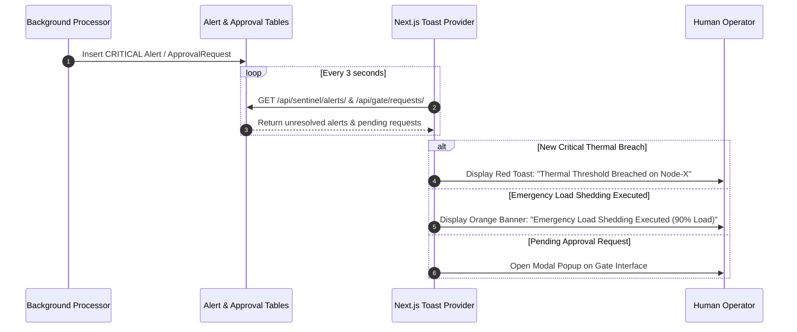

# 🔔 Real-Time Notifications & Alerting System

## 1. Overview

NeuronOps features a real-time notification system that alerts operators to thermal spikes, auto-migrations, emergency load shedding events, and pending human approvals.

---

## 2. Notification Flow & Event Pipeline

---

## 3. Alert Severity Styling & Toast Configurations

Notifications enforce strict visual hierarchy aligned with Nord palette themes:

| Severity | Color Theme | Border / Badge | Trigger Condition |
|:---|:---|:---|:---|
| **LOW** | Nord Blue (`#81a1c1`) | `border-blue-500` | Routine status info or minor load shift |
| **MEDIUM** | Nord Yellow (`#ebcb8b`) | `border-yellow-500` | Temp $85.0^\circ\text{C}-89.9^\circ\text{C}$ or load $> 80\%$ |
| **HIGH** | Nord Orange (`#d08770`) | `border-orange-500` | Temp $\ge 90.0^\circ\text{C}$ with live migration |
| **CRITICAL** | Nord Red (`#bf616a`) | `border-red-600 animate-pulse` | Temp $\ge 95.0^\circ\text{C}$ or load $> 90\%$ shedding |
