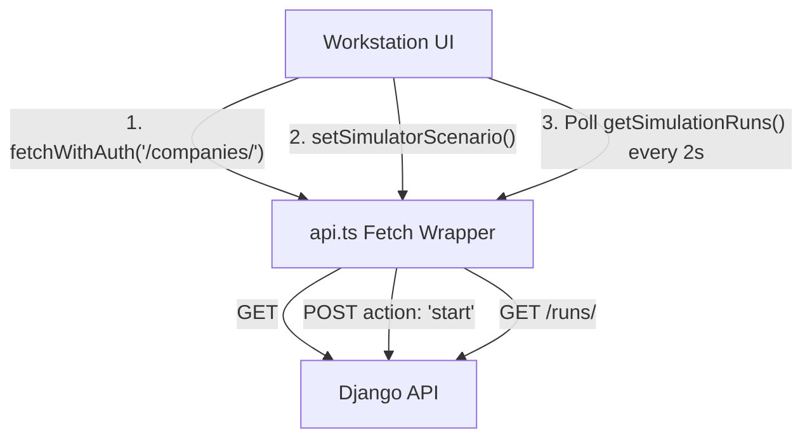

# Operator Workstation

The **Workstation** (`frontend/src/app/(workstation)/workstation/console/page.tsx`) is the primary mission control interface for injecting traffic and controlling the NeuronOps datacenter simulation.

## Architecture

The Workstation is a Next.js Client Component (`"use client"`) built with React and styled using Tailwind CSS (specifically utilizing the `Nord` color palette for a premium aesthetic).

## Component Layout

1. **Traffic Injection Parameters**: A configuration panel allowing the user to select the Company Profile, Traffic Scenario (e.g. `startup` vs `viral_event`), Duration, and Time Acceleration. 
2. **Action Controls**: Start and Stop buttons that invoke `scenario_control` on the backend, activating the `TrafficGenerator`.
3. **Active Workload Lifecycle (Kanban)**: A 3-column grid mapping directly to the `SimulationRun.status` field.
   - **QUEUED**: Awaiting assignment.
   - **PROCESSING**: Picked up by the `SchedulerEngine` and assigned to a hardware Tier.
   - **COMPLETED / FAILED**: The final resolution state.

## State Management
The page uses React's `useEffect` and `setInterval` to actively poll the backend every 2,000 milliseconds. 
Because the backend `TrafficGenerator` and `processor.py` daemons are modifying the database in the background at an accelerated rate, polling ensures the UI reflects the real-time swarm of workloads traversing the cluster.
