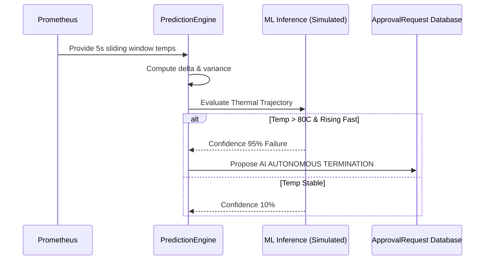

# Anomaly Detection Engine

The NeuronOps Control Plane incorporates a predictive Machine Learning layer (`PredictionEngine` inside `backend/processor.py`) designed to identify failing nodes before they crash.

## Flow of Anomaly Detection

## How It Works

Instead of waiting for a node to hit `85°C` (the hard shutdown limit), the `PredictionEngine` evaluates the *rate of change*.
If a node jumps from `65°C` to `80°C` rapidly while the rest of the cluster remains stable, the engine flags it as a **Thermal Anomaly**.

The system simulates an AI inference pass. If the confidence of imminent hardware failure exceeds a threshold, it preemptively logs an `ApprovalRequest` asking the human operator for permission to cordon the node or autonomously terminate the offending workloads.
