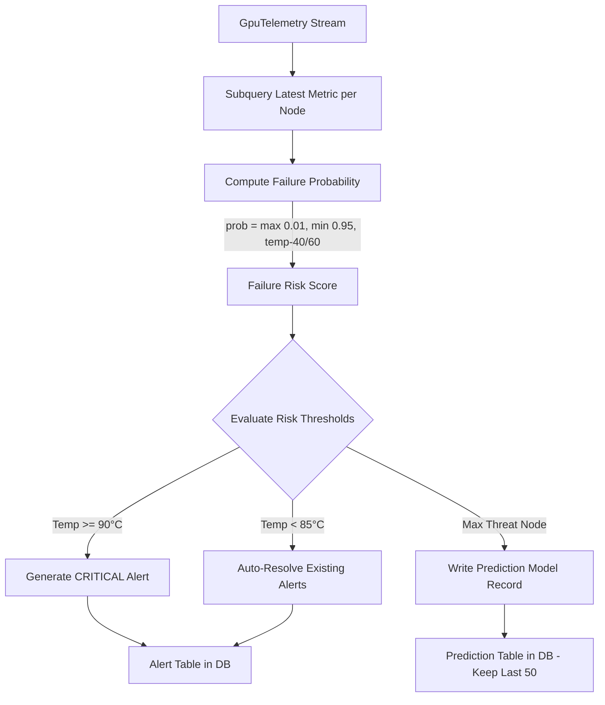

# 🤖 Sentinel AI Anomaly Detection Engine

## 1. Overview

The **Sentinel AI Anomaly Detection Engine** ([backend/sentinel](file:///d:/Ai-Cluster/backend/sentinel)) provides real-time failure prediction, anomaly classification, and thermal threat monitoring across all 128 cluster nodes.

---

## 2. Anomaly Detection Pipeline Diagram



---

## 3. Database Schema Definitions

### A. `Alert` Model ([backend/sentinel/models.py](file:///d:/Ai-Cluster/backend/sentinel/models.py))
```python
class Alert(models.Model):
    SEVERITY_CHOICES = [
        ('LOW', 'Low Risk'),
        ('MEDIUM', 'Medium Risk'),
        ('HIGH', 'High Risk'),
        ('CRITICAL', 'Critical Failure Threat'),
    ]

    node_id = models.CharField(max_length=32, db_index=True)
    severity = models.CharField(max_length=16, choices=SEVERITY_CHOICES)
    message = models.TextField()
    created_at = models.DateTimeField(auto_now_add=True)
    resolved = models.BooleanField(default=False)
```

### B. `Prediction` Model ([backend/sentinel/models.py](file:///d:/Ai-Cluster/backend/sentinel/models.py))
```python
class Prediction(models.Model):
    node_id = models.CharField(max_length=32)
    failure_probability = models.FloatField()  # 0.01 to 0.95
    reason = models.TextField()
    predicted_at = models.DateTimeField(auto_now_add=True)
```

---

## 4. Bounded Storage Maintenance (Prediction Pruning)

To guarantee high query performance on dashboard polling APIs, the processor engine prunes old prediction records on every tick, maintaining a sliding window of exactly **50 records**:

```python
# From processor.py (lines 129-137)
Prediction.objects.create(
    node_id=max_prob_node,
    failure_probability=max_prob_this_tick,
    reason=f"Max cluster threat: {max_prob_this_tick*100:.0f}%"
)
recent_ids = list(Prediction.objects.order_by('-predicted_at').values_list('id', flat=True)[:50])
if recent_ids:
    Prediction.objects.exclude(id__in=recent_ids).delete()
```

---

## 5. Sentinel API Endpoint Specifications

* `GET /api/sentinel/alerts/`: Returns active unresolved alerts.
* `GET /api/sentinel/predictions/`: Returns failure probability predictions.
* `POST /api/sentinel/alerts/{id}/resolve/`: Manually resolves an active alert.
