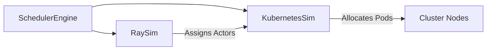

# Ray Distributed Processing Simulation

In a real AI datacenter, workloads are not just monolithic containers; they are often distributed across hundreds of GPUs using frameworks like Ray. NeuronOps simulates this distributed execution environment.

## Ray Integration Architecture

## `RaySim` Module (`backend/cluster_infra/ray_sim.py`)

When a complex workload (like LLM Pre-training requiring 32 GPUs) is assigned, the Control Plane uses the `RaySim` module to model distributed actor placement.

1. **Worker Assignment**: `RaySim.assign_worker(pod_id, task_label)` is called to simulate a Ray Head node assigning a slice of the tensor parallelism to a specific Kubernetes pod.
2. **Actor Lifecycle**: Just like real Ray, if a node overheats and goes offline, the simulated Ray cluster must reconstruct the lost actors on a new node (often triggering the `MigrationEngine`).

*Note: As a Digital Twin, this does not actually spin up a physical Ray cluster on your local machine, but rather injects the appropriate metadata into the `SimulationRun` to mirror how a Ray cluster behaves.*
