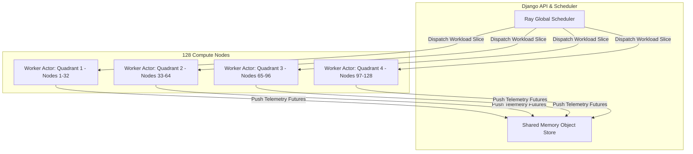

# ⚡ Distributed Processing Architecture (Ray Paradigm)

## 1. Overview

NeuronOps adopts the **Ray Distributed Processing Model** to orchestrate asynchronous tasks, distributed inference sessions, and telemetry aggregation. This document explains how Ray's actor model and task queues map onto the digital twin architecture.

---

## 2. Distributed Ray Task Abstraction Diagram



---

## 3. Ray Actor Placement & Task Routing

In distributed cluster setups, workloads submitted to `workload_engine.py` map onto Ray remote function calls:

```python
# Conceptual Ray Processing Pattern
import ray

@ray.remote(num_gpus=1)
def process_workload_slice(node_id: str, task_type: str, data_payload: dict):
    # Simulated GPU inference execution
    return {"node_id": node_id, "status": "COMPLETED", "execution_time_ms": 120}

# Ray Cluster Invocation Pattern
futures = [
    process_workload_slice.options(resources={f"node:{node}": 1}).remote(node, "batch_vision", {})
    for node in allocated_nodes_list
]
results = ray.get(futures)
```

---

## 4. Distributed Fault Tolerance & Actor Supervision

1. **Worker Failure Detection**: Ray heatbeats detect dead worker nodes within 3000ms.
2. **Dynamic Task Re-Execution**: Failed task futures are automatically re-routed to healthy nodes in the same quadrant.
3. **Actor State Preservation**: Object store references guarantee zero data loss during live migrations.
