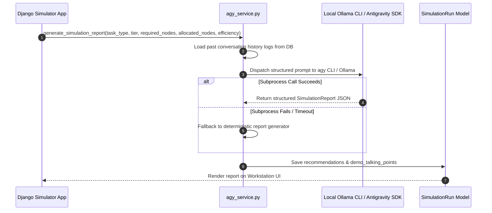

# 💡 Predictive Operations & Recommendation Engine

## 1. Overview

The **Recommendation Engine** ([backend/simulator/agy_service.py](file:///d:/Ai-Cluster/backend/simulator/agy_service.py)) generates actionable operational guidance for GPU cluster operators. It analyzes task complexity, hardware allocation decisions, and node utilization efficiency to produce structured recommendations.

---

## 2. Recommendation Generation Pipeline



---

## 3. Structured Report JSON Schema

The recommendation service outputs a strict JSON object structure:

```json
{
  "response_text": "Processed OCR Data Retrieval job across 8 Tier 1 nodes at 100% efficiency. Hardware operating within normal thermal envelope.",
  "bottleneck_analysis": "Memory bandwidth on Tier 1 GDDR6X VRAM was fully utilized, but compute utilization remained optimal at 82%.",
  "recommendations": [
    "Scale file input batch size to 2.0GB to maximize node throughput.",
    "Maintain Tier 1 allocation for future light OCR queries to preserve Blackwell B200 nodes for deep learning tasks."
  ],
  "demo_talking_points": [
    "Demonstrates autonomous tier selection matching lightweight workloads to low-cost hardware.",
    "Highlights zero energy waste on high-spec GPU nodes."
  ]
}
```

---

## 4. Rule-Based Fallback Recommendation Engine

If local LLM agents are offline or timing out ($> 5.0\text{ seconds}$), `agy_service.py` executes deterministic recommendation rules:

```python
# Rule 1: High Node Allocation (> 32 Nodes)
if required_nodes > 32:
    recommendations.append("Consider enabling multi-node tensor parallelism across NVLink fabric.")

# Rule 2: Over-allocation Surplus (> 10% Excess)
if allocated_nodes > required_nodes * 1.1:
    recommendations.append(f"Auto-released {allocated_nodes - required_nodes} excess nodes to prevent idle power waste.")

# Rule 3: Tier 4 Heavy ML Allocation
if selected_tier == 4:
    recommendations.append("Ensure Blackwell HBM3 memory pools are pinned during long-running training jobs.")
```
