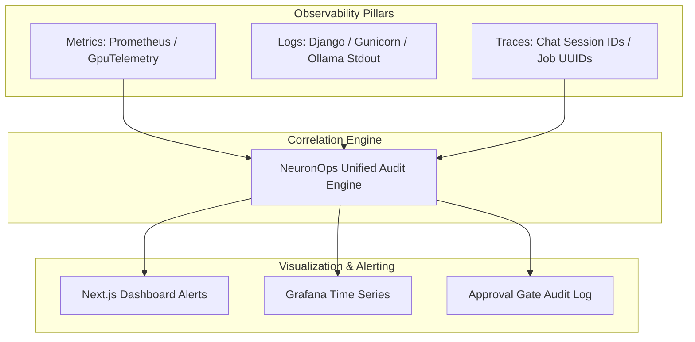

# 👁️ Unified Observability & Telemetry Matrix

## 1. Overview

NeuronOps unifies the three pillars of observability — **Metrics**, **Logs**, and **Traces** — into a coherent operational matrix. This ensures full traceability from user UI clicks down to physical node temperature variations and database transaction commits.

---

## 2. Observability Matrix Architecture



---

## 3. Distributed Tracing via `chat_session_id` & `job_id`

Every request submitted through the Workstation injects a persistent `chat_session_id` and `job_id` into all downstream logs:

* **Frontend**: Generates `session-uuid` in local storage.
* **Django API**: Attaches `chat_session_id` to `SimulationRun` model.
* **Processor Engine**: Emits log entries prefixed with `[SCHEDULER]`, `[GATE]`, `[AGENT]`, and `[PROCESSOR]`.
* **Migration Records**: Logs `job_id=f"LLM-CTX-{timestamp}"` in `WorkloadPlacement`.

---

## 4. Log Format Specification

System components write structured logs to standard stdout:

```log
[2026-07-22 05:30:15] [PROCESSOR] [INFO] Evaluated 128 nodes telemetry. Active: 64, Idle: 64. Max prob: 0.15 on Node-012.
[2026-07-22 05:30:20] [SCHEDULER] [WARNING] Hard problem detected on Node-045 (91.2C). No idle nodes available.
[2026-07-22 05:30:20] [AGENT] [INFO] Local Ollama RCA: Critical thermal breach at 91.2C. Evicting non-essential batch jobs.
[2026-07-22 05:30:20] [GATE] [NOTICE] Auto-executed KILL NON-ESSENTIAL WORKLOADS on Node-045 autonomously.
```
