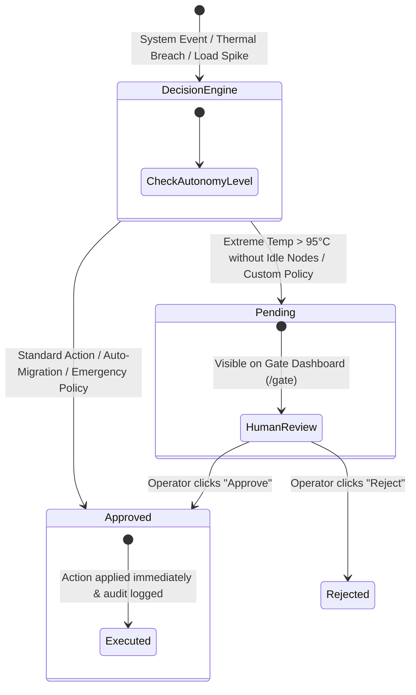

# 🛡️ Approval Gate System & Human-in-the-Loop Governance

## 1. Overview

The **Approval Gate System** ([backend/gate](file:///d:/Ai-Cluster/backend/gate)) acts as the safety and governance subsystem for NeuronOps. It enforces policy rules, logs autonomous AI decisions, and provides a Human-in-the-Loop (HITL) escalation interface when critical system thresholds are exceeded.

---

## 2. Approval Request State Machine Diagram



---

## 3. Database Schema Definition (`ApprovalRequest`)

The `ApprovalRequest` model ([backend/gate/models.py](file:///d:/Ai-Cluster/backend/gate/models.py)) persists all policy actions:

```python
class ApprovalRequest(models.Model):
    ACTION_TYPES = [
        ('LLM Session Live Migration', 'LLM Session Live Migration'),
        ('KILL NON-ESSENTIAL WORKLOADS', 'Kill Non-Essential Workloads'),
        ('EMERGENCY LOAD SHEDDING', 'Emergency Load Shedding'),
        ('AI AUTONOMOUS TERMINATION', 'AI Autonomous Termination'),
    ]

    STATUS_CHOICES = [
        ('PENDING', 'Pending Human Approval'),
        ('APPROVED', 'Approved & Executed'),
        ('REJECTED', 'Rejected by Operator'),
    ]

    action_type = models.CharField(max_length=64, choices=ACTION_TYPES)
    target_resource = models.CharField(max_length=64)  # e.g., "Node-014" or "Cluster Wide"
    reason = models.TextField()
    status = models.CharField(max_length=16, choices=STATUS_CHOICES, default='PENDING')
    requested_at = models.DateTimeField(auto_now_add=True)
    approved_at = models.DateTimeField(null=True, blank=True)
    approved_by = models.ForeignKey(User, null=True, blank=True, on_demand=True)
```

---

## 4. Policy Execution Rules & Autonomy Boundaries

| Action Type | Trigger Condition | Status Assigned | Approved By |
|:---|:---|:---|:---|
| **LLM Session Live Migration** | Node temp $\ge 90^\circ\text{C}$ & Idle nodes exist | `APPROVED` | `admin` (Auto) |
| **KILL NON-ESSENTIAL WORKLOADS** | Node temp $\ge 90^\circ\text{C}$ & No idle nodes | `APPROVED` | `admin` (Auto) |
| **AI AUTONOMOUS TERMINATION** | Cluster load $> 80\%$ | `APPROVED` | `admin` (Auto) |
| **EMERGENCY LOAD SHEDDING** | Cluster load $> 90\%$ | `APPROVED` | `admin` (Auto) |
| **Extreme Temp Escalation** | Node temp $\ge 95^\circ\text{C}$ requiring operator override | `PENDING` | Awaits Human Operator |

---

## 5. Human-in-the-Loop Gate Dashboard API

Operators interact with pending approval requests through dedicated endpoints ([backend/gate/views.py](file:///d:/Ai-Cluster/backend/gate/views.py)):

* `GET /api/gate/requests/` — Returns list of all approval requests (filterable by status `PENDING`, `APPROVED`, `REJECTED`).
* `POST /api/gate/requests/{id}/approve/` — Marks request as `APPROVED`, logs `approved_at = timezone.now()`, and executes target resource command.
* `POST /api/gate/requests/{id}/reject/` — Marks request as `REJECTED`, cancelling planned remediation.
