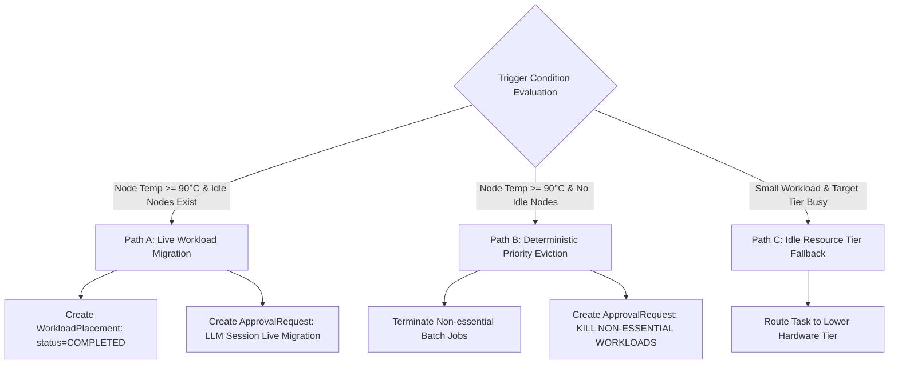

# 🛟 Fallback Engine & Live Migration Architecture

## 1. Overview

NeuronOps incorporates an automated **Fallback & Live Migration Engine** designed to protect GPU hardware during thermal spikes and optimize cluster energy consumption when workloads are lightweight.

---

## 2. Fallback Mechanics & Execution Pathways



---

## 3. Path A: Live Workload Migration Specification

When a node's temperature reaches `90°C` and at least one node in the cluster is idle (`gpu_utilization_percent < 5%`):

1. **Target Selection**: The processor pops the first node from `idle_nodes` list.
2. **Context Snapshot**: The live LLM context session ID is logged.
3. **Migration Record**: A `WorkloadPlacement` model record ([backend/scheduler/models.py](file:///d:/Ai-Cluster/backend/scheduler/models.py)) is created:
   ```python
   WorkloadPlacement.objects.create(
       job_id=f"LLM-CTX-{int(time.time())}",
       source_node=hot_node,
       target_node=target,
       reason=f"Autonomously migrating off {hot_node} to {target} due to thermal anomaly ({temp:.1f}C).",
       status="COMPLETED"
   )
   ```
4. **Approval Gate Logging**: An `ApprovalRequest` with `action_type="LLM Session Live Migration"` and `status="APPROVED"` is recorded.

---

## 4. Path B: Deterministic Priority Eviction Specification

When a node's temperature reaches `90°C` and **no idle nodes are available** in the entire cluster:

1. **State Analysis**: `analyze_cluster_state(hot_node, temp)` is invoked in `processor.py`.
2. **Root Cause Generation**: Local Ollama LLM is queried to produce a 1-sentence diagnostic explanation. If Ollama is unavailable, the fallback string `"Critical thermal breach at {temp}C. Evicting non-essential batch jobs to prevent hardware damage."` is used.
3. **Action Execution**: Non-essential batch jobs on the target node are terminated immediately.
4. **Audit Trail**: An `ApprovalRequest` with `action_type="KILL NON-ESSENTIAL WORKLOADS"` and `status="APPROVED"` is persisted.

---

## 5. Path C: Idle Resource Tier Fallback Specification

When a compute task requests $\le 12$ nodes and has a default target tier $> 1$:
* If Tier 1 (`Nodes 1-32`) has zero active simulation runs, the workload engine automatically routes the request to Tier 1.
* **Result**: High-spec Tier 3 (RTX 5090) and Tier 4 (Blackwell B200) nodes remain free for large AI projects, avoiding low-utilization energy waste.
