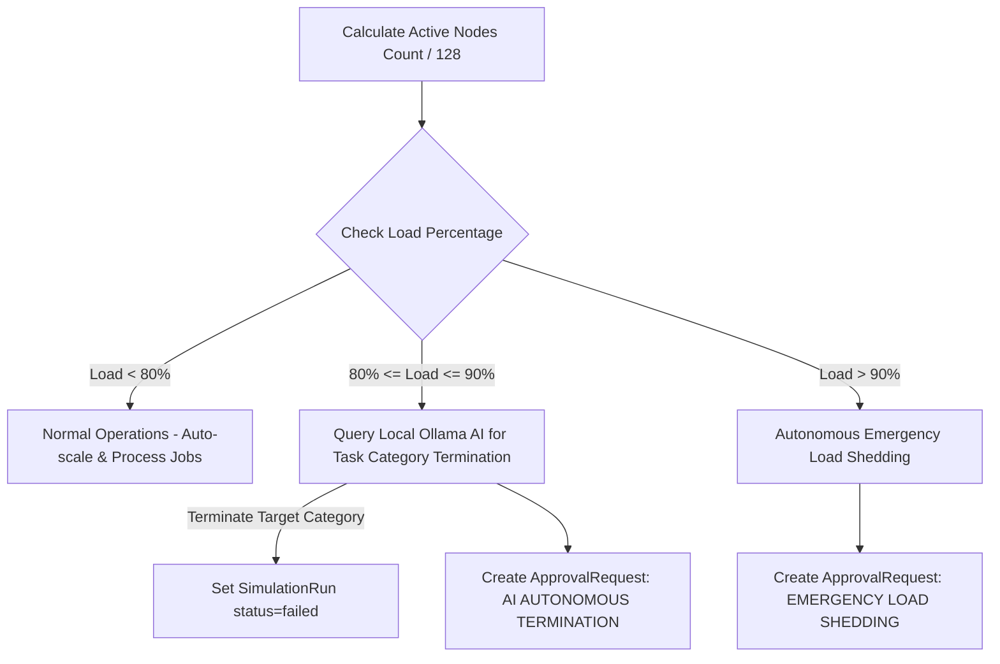

# 📅 Smart Scheduler Architecture & Bin-Packing Algorithm

## 1. Overview

The **Smart Scheduler** component operates across two layers:
1. **Frontend Request Scheduler**: Evaluates hardware tier availability and auto-scales requested allocations in real time ([backend/simulator/workload_engine.py](file:///d:/Ai-Cluster/backend/simulator/workload_engine.py)).
2. **Background Deterministic Scheduler**: Performs continuous cluster load monitoring, live workload migrations, and load-shedding terminations ([backend/processor.py](file:///d:/Ai-Cluster/backend/processor.py)).

---

## 2. Global Load Threshold Policy Matrix

The deterministic processor engine tracks global active node utilization:

$$\text{ClusterLoad}_{\%} = \frac{128 - \text{Count}(\text{IdleNodes})}{128.0}$$



### Policy Threshold Rules:

#### A. Level 1: Normal Operations (`< 80%` Load)
* All compute requests process normally.
* Thermal drift and VRAM allocations operate within standard bounds.

#### B. Level 2: AI Autonomous Termination (`80%` to `90%` Load)
* The system detects heavy cluster pressure.
* The processor queries local Ollama AI model (`llama3`):
  > *"The cluster is at 80% capacity. Which non-essential task type should we put on hold or terminate first to stabilize? Return exactly one word."*
* The returned task category (e.g. `image_generation` or `normal_chats`) is marked as `failed` in the database, freeing capacity.
* An `ApprovalRequest` record with `action_type="AI AUTONOMOUS TERMINATION"` and `status="APPROVED"` is created.

#### C. Level 3: Emergency Load Shedding (`> 90%` Load)
* Emergency threshold reached.
* The system executes cluster-wide emergency load shedding autonomously.
* An `ApprovalRequest` record with `action_type="EMERGENCY LOAD SHEDDING"` and `status="APPROVED"` is created with administrator authorization logged (`approved_by=admin`).

---

## 3. Bin-Packing & Quadrant Allocation Logic

When nodes are allocated, the telemetry engine assigns them sequentially within quadrant boundaries to maximize thermal isolation and minimize cross-quadrant NVLink fabric congestion:

```python
# From telemetry_generator.py (lines 96-102)
start_idx = (tier - 1) * 32
assigned = 0
idx = start_idx
while assigned < total_nodes and len(active_node_indices) < 128:
    if idx not in active_node_indices:
        active_node_indices.add(idx)
        node_tier_map[idx] = tier
        assigned += 1
    idx = (idx + 1) % 128
```

* **Tier 1 Jobs**: Packed within `Node-001` to `Node-032`.
* **Tier 2 Jobs**: Packed within `Node-033` to `Node-064`.
* **Tier 3 Jobs**: Packed within `Node-065` to `Node-096`.
* **Tier 4 Jobs**: Packed within `Node-097` to `Node-128`.

If a quadrant overflows, the allocator wraps around circularly (`(idx + 1) % 128`) to borrow nodes from adjacent idle quadrants.
