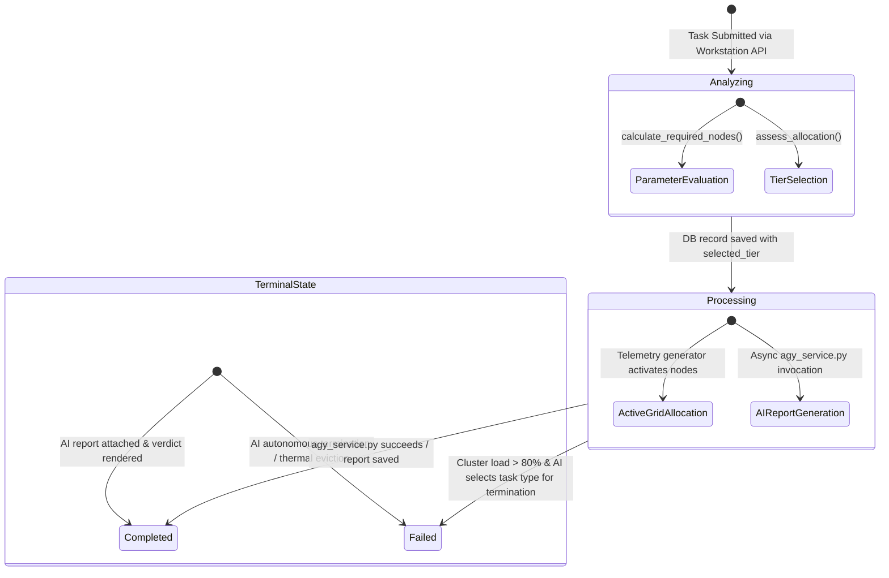

# 🔄 Workload Execution Lifecycle

## 1. Overview

This document documents the lifecycle of a simulation workload submitted to NeuronOps. Workloads are represented in the database as `SimulationRun` model records ([backend/simulator/models.py](file:///d:/Ai-Cluster/backend/simulator/models.py)).

---

## 2. Workload State Machine Diagram



---

## 3. Workload State Definitions

### 1. `analyzing`
* **Trigger**: Client issues `POST /api/simulator/runs/`.
* **Actions**:
  * Calculates `required_nodes`.
  * Runs tier evaluation algorithms (`assess_allocation()`).
  * Assigns initial parameters (`selected_tier`, `allocated_nodes_actual`, `verdict`).

### 2. `processing`
* **Trigger**: Initial allocation assessment completes.
* **Actions**:
  * Saves `SimulationRun` with status `processing`.
  * Telemetry generator detects run in active 120-second window and drives active node metrics.
  * Dispatches asynchronous task to `agy_service.py` to generate structured report.

### 3. `completed`
* **Trigger**: `agy_service.py` finishes generating AI breakdown, recommendations, and talking points.
* **Actions**:
  * Populates `bottleneck_analysis`, `recommendations`, `demo_talking_points`, `ai_raw_report`.
  * Sets `completed_at = timezone.now()` and status `completed`.

### 4. `failed`
* **Trigger**: System load exceeds 80% capacity and the autonomous AI processor engine selects this workload category for load shedding.
* **Actions**:
  * Updates `response_text = "[AI AUTONOMOUS OVERRIDE] Task terminated to stabilize cluster load."`.
  * Sets status `failed`.

---

## 4. API Response Structure for Active Workload

When frontend clients query active simulation runs (`GET /api/simulator/runs/active/`), the backend returns structured JSON payload matching the active state:

```json
{
  "id": 42,
  "task_type": "large_ml_project",
  "user_count": 100,
  "selected_tier": 4,
  "allocated_nodes": 64,
  "allocated_nodes_actual": 64,
  "required_nodes": 64,
  "efficiency_pct": 100.0,
  "verdict": "optimal",
  "status": "completed",
  "bottleneck_analysis": "All 64 Blackwell B200 nodes operating at 98% efficiency with 192GB HBM3 VRAM per node.",
  "created_at": "2026-07-22T05:30:00Z",
  "completed_at": "2026-07-22T05:30:03Z"
}
```
