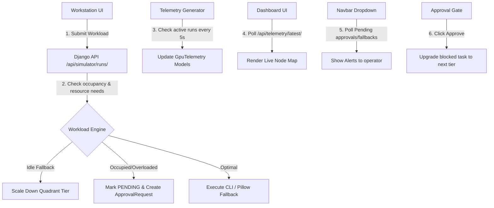

# ClustroConnect Cluster Simulation & Workload Flow

> [!TIP]
> **Viewing in Antigravity IDE**: Open this document inside the Antigravity IDE and click the **Markdown Preview** button (or press `Ctrl+Shift+V` / `Cmd+Shift+V`) with the **Mermaid Extension** enabled to render the interactive system architecture diagram.

This document details the architecture, active features, data flows, and configuration workflows of the ClustroConnect Cluster system. It is designed to help contributors (on both Linux and Windows) set up, run, and modify the application.

---

## 1. Current Project Architecture & Data Flow



### Key Workflows:
1. **Workstation Input Submission**:
   - The user selects a Preset Task Type (OCR, Image Generation, Batch Vision, etc.) and allocates a target node count (1 to 32) using the range slider.
   - Upon submitting a prompt, a POST request is sent to the Django simulator API.
2. **Workload Analysis & Fallback Logic**:
   - **Idle Fallback**: If a task requires high minimum tier resources (e.g. Tier 4 Blackwell) but the user allocates a low node count (`<= 12 nodes`), the engine automatically falls back to a lower-specification quadrant tier (e.g. Tier 3 RTX 5090) to conserve compute cost.
   - **Occupancy & Overload Check**: The backend queries active simulation runs. If the target quadrant tier is already occupied, the incoming task is marked as `pending` (blocked) and a `PENDING` `ApprovalRequest` is created.
   - **Pillow & Image Output Fallbacks**: When executing, the backend looks for diffusion-generated outputs. If missing or if the API tokens are exhausted, it dynamically renders vector Nord-themed images matching the task type using Pillow.
3. **Telemetry & Dashboard Reporting**:
   - A background script (`telemetry_generator.py`) runs on a loop. It checks for active simulation runs and lights up the corresponding quadrant nodes on the Dashboard map (Tier 1: Nodes 1–32, Tier 2: Nodes 33–64, etc.) to show high VRAM, power, and utility.
4. **Approval Gate & Workload Migration**:
   - If a task is blocked due to overload, the operator sees a `MIGRATE` request on the Dashboard's **Required Action Approvals** card.
   - Clicking **Approve** updates the blocked run's status to `completed`, migrates its execution to the next higher quadrant tier, and triggers its final reports.

---

## 2. Interactive Features & Navbar Alerts

* **Navbar Notification Dropdown**: A notification bell is integrated into the navbars of both the Dashboard and Workstation layouts. It polls for pending approvals and active fallback alerts:
  * `⚠️ OVERLOAD ALERT`: Displays details of overloaded quadrants needing migration.
  * `⚡ IDLE FALLBACK`: Displays warning summaries of low-resource tasks that automatically fell back to cheaper hardware.
* **Dashboard Alignment**: The Workstation UI matches the Dashboard's design tokens (soft shadows, premium hover scale-up translations, low-contrast `border-nord3/10` borders, and `fadeInUp` entrance animations) while preserving its Nord Light aesthetic.

---

## 3. Contributor Guide for Windows Users

Other contributors running Windows can execute and develop this project by following these steps:

### A. Environment Configuration & Python Virtual Env
Windows utilizes different path separators (`\`) and script execution policies.
1. Open PowerShell as Administrator and enable script execution (if not already done):
   ```powershell
   Set-ExecutionPolicy -ExecutionPolicy RemoteSigned -Scope LocalMachine
   ```
2. Create and activate the Python virtual environment:
   ```powershell
   cd backend
   python -m venv venv
   .\venv\Scripts\Activate.ps1
   ```
3. Install dependencies:
   ```powershell
   pip install -r requirements.txt
   ```

### B. Setting Up the Orchestrator CLI & SDK on Windows
If the Orchestrator SDK or command-line tools are installed, ensure they are in the Windows user environment PATH:
1. **User PATH Variable**: 
   - Open Start and search for "Edit the system environment variables".
   - Click "Environment Variables".
   - Under "User variables", edit `Path` and add the path to the directory containing the `orchestrator.exe` executable (e.g. `C:\Users\<username>\AppData\Local\Programs\orchestrator\bin`).
2. **Verifying Installation**:
   Since the project interacts directly with the **Orchestrator CLI** (`orchestrator`) already installed on the system, no manual API tokens or custom environment keys are required. Verify that the CLI is executable from your PowerShell terminal:
   ```powershell
   orchestrator --version
   ```


### C. Running Django Servers on Windows
To run the telemetry generators and processor scripts in the background, open separate PowerShell windows:
1. **Telemetry Feed Generator**:
   ```powershell
   .\venv\Scripts\Activate.ps1
   python telemetry_generator.py
   ```
2. **Django Runserver**:
   ```powershell
   .\venv\Scripts\Activate.ps1
   python manage.py runserver
   ```
