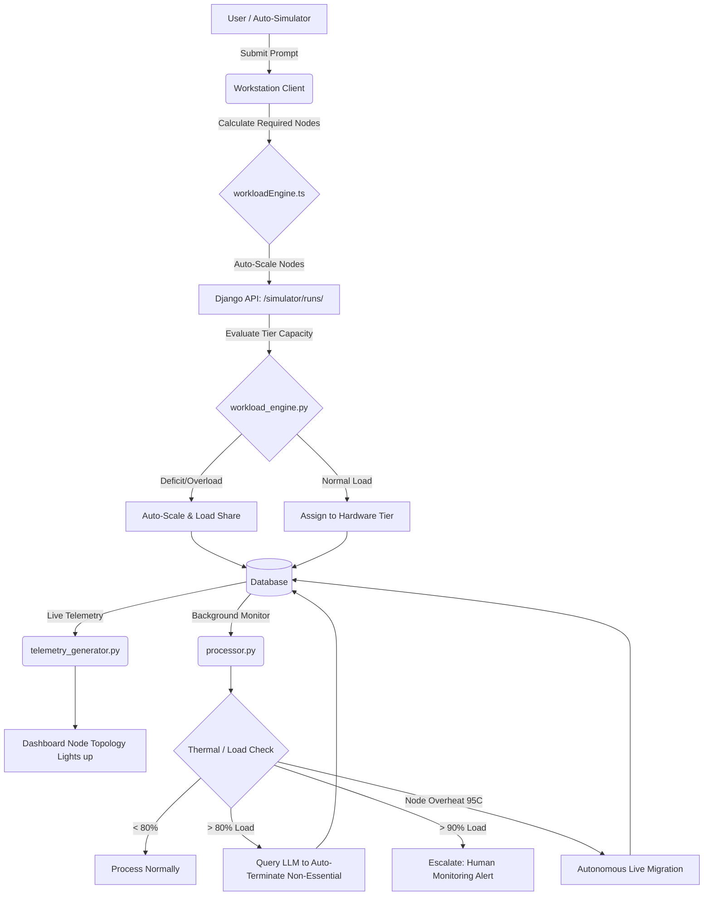

# Project Activity & Modifications Log

This document tracks the recent architectural modifications and bug fixes implemented to transform the NeuronOps SaaS into a fully autonomous system.

## 1. Frontend Enhancements (UI/UX)
- *Workstation UI Bug Fix*: Resolved an issue where selecting certain tasks cleared the inputText to an empty string, disabling the "Start Simulation" button. Added pre-filled prompts for all task types.
- *Pending Status Feedback*: Modified page.tsx within the Workstation to explicitly display: "Simulation pending human approval in Execution Gate due to cluster overload". This prevents the UI from getting stuck on an infinite "Analyzing workload..." message when workloads are intentionally halted.

## 2. Workload Routing Automation (Backend & Frontend)
- *backend/simulator/workload_engine.py*: Rewrote the node allocation logic to bypass manual intervention. The system now auto-scales up for any node deficit instead of blocking tasks with >20% deficit. It also automatically load-shares overflow tasks instead of placing them in the pending Execution Gate.
- *frontend/src/app/services/workloadEngine.ts*: Replicated the backend changes to ensure the frontend client autonomously auto-scales requested nodes without triggering an "OVERLOAD" client-side block.

## 3. Background Processor Automation
- *backend/processor.py*: Upgraded the background deterministic heuristics. 
  - *Emergency Load Shedding*: When cluster load >90%, the processor now auto-executes the load shedding protocol (status="APPROVED") rather than submitting a PENDING request to a human admin.
  - *Heuristic Workload Kills*: When GPUs overheat with no idle fallback, non-essential processes are auto-terminated (status="APPROVED") without human escalation.

## 4. Database Optimization
- *Execution Gate Purge*: Wrote and executed a native sqlite3 Python script to successfully delete 58 legacy "pending" ghosts from simulator_simulationrun and gate_approvalrequest. This cleared the massive backlog blocking the 128-node cluster, restoring live GPU telemetry streaming.

## 5. Documentation & Pitch Deck
- *ceo.md*: Generated a comprehensive tech stack and concept note illustrating the problem, solution, and growth potential of the autonomous cluster SaaS.
- *reviewer.md*: Restructured the concept note to specifically highlight 4 core technical goals: Hardware-aware task routing (Blackwell vs RTX3090), elastic scaling on user drops, crash fault-tolerance, and threshold-based LLM load shedding.

---

## Autonomous SaaS Workflow Diagram

