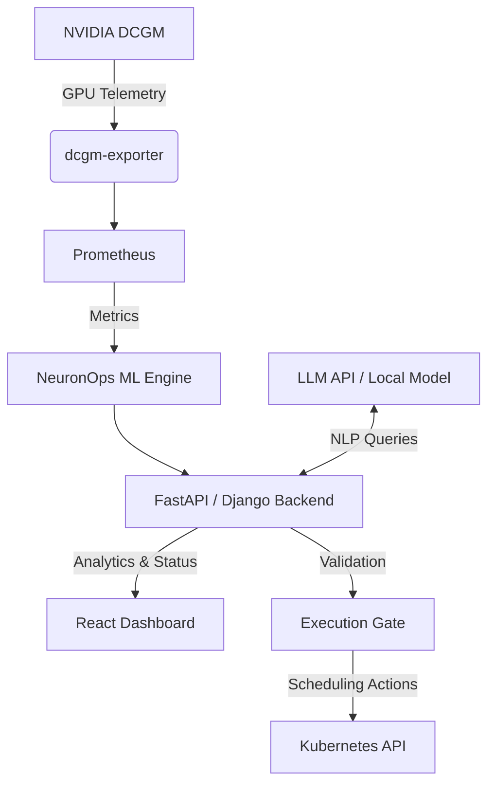

# NeuronOps: The Intelligent Brain for GPU Clusters
**SaaS Documentation**

---

## 1. Executive Summary & Main Goal
**NeuronOps** is an agentic AI infrastructure SaaS designed to sit above Kubernetes and Prometheus. Its primary goal is to optimize GPU cluster operations by predicting hardware failures, autonomously scheduling workloads to the most efficient nodes, and eliminating idle GPU waste—all accessible via a Natural Language Processing (NLP) interface.

Instead of just providing a reactive dashboard of *what happened*, NeuronOps acts proactively to save compute resources, reduce financial waste, and improve ecological efficiency (e.g., power consumption and chilled water).

---

## 2. Core Capabilities & Modules
The platform is broken down into three intelligent modules governed by a unified interface:

1. **Sentinel (Predictive Maintenance)**
   * **Function:** Predicts GPU and node failures before they occur.
   * **How it works:** Ingests time-series telemetry (temperature, memory, utilization) and uses anomaly detection models (Isolation Forest, LSTM) to flag imminent hardware degradation.

2. **Scheduler (Workload Optimization)**
   * **Function:** Autonomously places and migrates workloads to optimal GPUs/nodes.
   * **How it works:** Employs bin-packing optimization and learns utilization patterns to aggressively pack workloads, allowing empty nodes to be put into deep sleep. It can live-migrate tasks (like LLM context) to standby GPUs if Sentinel predicts throttling.

3. **CostWatch (Resource Efficiency)**
   * **Function:** Detects idle GPUs, zombie jobs, and overallocation.
   * **How it works:** Utilizes threshold detection and trend analysis to calculate cost savings and identify wasteful resource allocations.

4. **NeuronOps Copilot (NLP Interface)**
   * **Function:** Allows operators to interact with the cluster using natural language.
   * **How it works:** Instead of manually querying logs, an admin can ask, "Why is GPU-7 hot?" and the Copilot will explain the issue and suggest or execute mitigation strategies.

5. **Execution Gate (Security & Safety Layer)**
   * **Function:** Ensures AI-driven decisions are safe to execute.
   * **How it works:** Intercepts actions from the Scheduler/Copilot before they reach the Kubernetes API, applying strict Role-Based Access Control (RBAC) and policy schema validation.

---

## 3. Architecture & Data Flow
The architecture is designed to ingest standard cluster telemetry and apply machine learning intelligence on top:

### Data Pipeline Logic:
1. **Ingestion:** NVIDIA DCGM collects GPU hardware telemetry which is exported to Prometheus.
2. **Analysis:** Python-based ML scripts (`processor.py`, `telemetry_generator.py`) consume these metrics to train models and detect anomalies.
3. **API & Interface:** The backend serves this data to a Next.js frontend, presenting high-fidelity dashboards (e.g., "Nexus Core Dashboard", "Mesh Operations Center").
4. **Execution:** When an anomaly is detected, an action is formulated, run through the Execution Gate, and executed via the Kubernetes API.

---

## 4. Environments, Tools, and Frameworks
Based on the project structure and deployment configuration (`docker-compose.yml`), the system relies on the following tech stack:

### Infrastructure & Orchestration
* **Kubernetes:** Core container orchestration and cluster management.
* **Docker & Docker Compose:** Used for containerization and local development (`db`, `backend`, `processor`, `telemetry`, `frontend` services).
* **NVIDIA DCGM:** GPU telemetry standard.
* **Prometheus:** Time-series database for metrics.

### Backend & ML Engine
* **Language:** Python 3 (with `pyright` for type checking).
* **Web Framework:** Django (currently configured via `DJANGO_SETTINGS_MODULE` in Docker) / FastAPI (planned for async, typed APIs).
* **Database:** PostgreSQL (`postgres:15-alpine`).
* **Machine Learning:** `scikit-learn` (Isolation Forest) and time-series models (Prophet/LSTM).
* **NLP:** OpenAI API / Local LLMs (Ollama).

### Frontend
* **Framework:** Next.js / React with strict TypeScript.
* **Styling & Components:** Custom CSS focusing on Neuform component design (dark mode, WebGL/Three.js support, sophisticated layout rhythms like Bento grids).
* **Data Visualization:** Recharts (or similar charting libraries) for telemetry streaming.

---

## 5. Areas for Improvement & Future Work
While the architecture is robust, the following areas offer room for enhancement:

1. **Framework Alignment (Backend):**
   * *Issue:* The `docker-compose.yml` specifies a Django backend (`DJANGO_SETTINGS_MODULE=neuronops.settings`), but the implementation plan strongly recommends FastAPI for async typing and ML integration.
   * *Improvement:* Standardize the backend stack to FastAPI for better performance with asynchronous ML and cluster queries.

2. **Execution Gate Hardening:**
   * *Issue:* AI must not execute cluster changes directly without supervision.
   * *Improvement:* Implement a robust "Human-in-the-loop" approval workflow in the UI for critical migrations, and expand the RBAC middleware to have zero-trust fallback states.

3. **Telemetry Integration & Realism:**
   * *Issue:* Current deployment uses a `telemetry_generator.py` (mock data).
   * *Improvement:* Transition from mock telemetry to a live Kubernetes cluster with actual NVIDIA GPUs running DCGM exporters for real-world stress testing.

4. **LLM Resilience:**
   * *Issue:* Dependency on external LLM APIs (like OpenAI) creates a single point of failure if the API timeouts.
   * *Improvement:* Introduce a localized, lightweight LLM (e.g., via Ollama) as a fallback state to ensure the Copilot remains functional during external outages.

5. **Model Online Learning:**
   * *Issue:* Training models statically on historical data might miss new types of hardware degradation.
   * *Improvement:* Implement online/continuous learning for the Isolation Forest and LSTM models so they adapt to changing workload behaviors over time.
